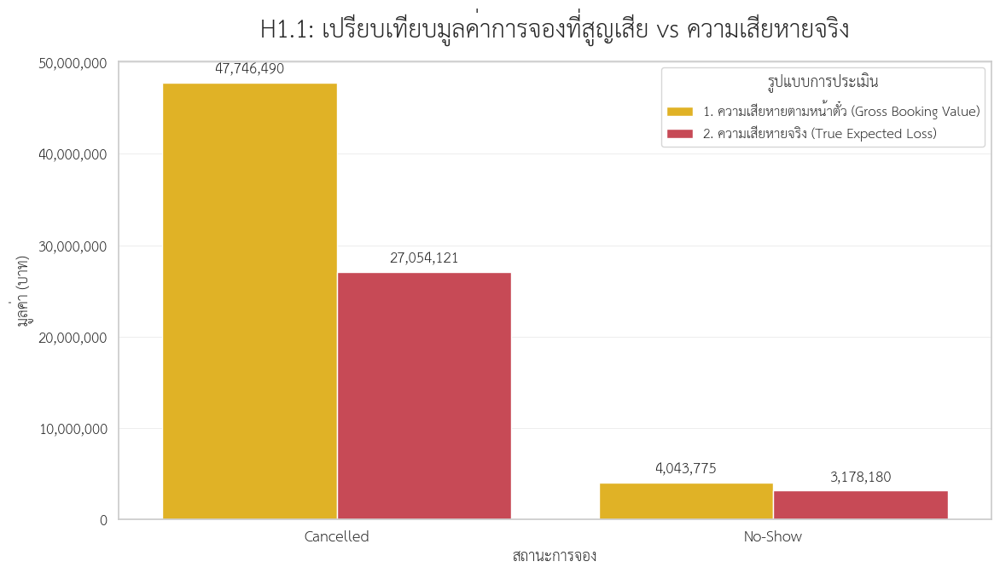
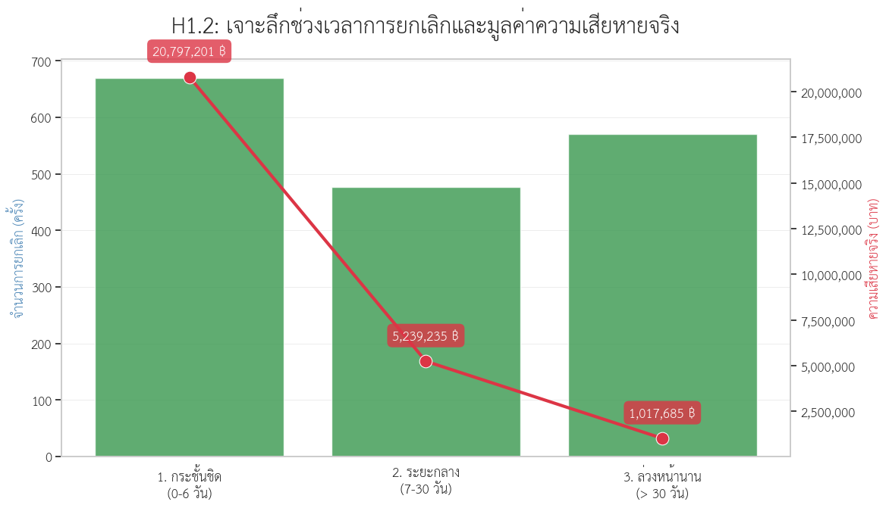
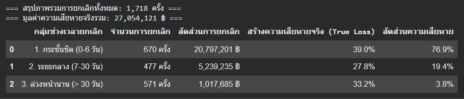

# The Azure Stay Hotel Revenue Leakage Management

โครงการนี้เป็นส่วนหนึ่งของรายวิชา CP372 Data Analytics and Business Intelligence โดยมีวัตถุประสงค์เพื่อประยุกต์ใช้เครื่องมือและกระบวนการวิเคราะห์ข้อมูลเพื่อแก้ไขปัญหาทางธุรกิจจริง

โครงการนี้มุ่งเน้นไปที่การแก้ปัญหา การรั่วไหลของรายได้ (Revenue Leakage) ของโรงแรม The Azure Stay ซึ่งเกิดจากการยกเลิกจองกะทันหันและการที่ลูกค้าจองแล้วไม่มาเข้าพัก (No-shows)

# 1. Background and Pain points
โรงแรมขนาดกลางที่บริหารงานอิสระชื่อ "The Azure Stay" แม้ว่าตัวโรงแรมจะสวยงามและมีศักยภาพ แต่ผลกำไรกลับหยุดนิ่งไม่เติบโต

ปัญหาหลักคือการรั่วไหลของรายได้จากการยกเลิกจองและการไม่เข้าพัก (Revenue Leakage - Cancellations & No-Shows) ตารางการจองห้องพักของคุณดูเหมือนจะถูกจองเต็มล่วงหน้าถึง 2 สัปดาห์ แต่เมื่อถึงวันเข้าพักจริง กลับกลายเป็นว่ามีห้องว่างเหลืออยู่จำนวนมาก

สาเหตุมาจากการยกเลิกกะทันหัน (Last-minute cancellations) และลูกค้าที่จองไว้แต่ไม่มาปรากฏตัว (No-shows) ทำให้คุณไม่สามารถนำห้องเหล่านั้นไปขายต่อให้ลูกค้าคนอื่นได้ทันเวลา

ผลกระทบทางธุรกิจ:
- เสียลูกค้าตัวจริง: ปฏิเสธคนที่พร้อมจ่าย เพราะระบบโชว์ว่าห้องเต็มไปแล้ว (Opportunity Cost)
- เสียต้นทุนฟรี: พนักงานและวัตถุดิบถูกเตรียมไว้ล่วงหน้า เกิดเป็นต้นทุนจม (Sunk Cost)

เป้าหมายคือ ลดการสูญเสียรายได้ที่เกิดจากความต้องการเข้าพักแบบปลอมๆ (Fake demand) หรือความต้องการที่ไม่แน่นอน (Unstable demand)

# 2. Smart Objectives
```
เพื่อกู้คืนรายได้ที่สูญเสียไป อย่างน้อย 15% ภายในระยะเวลา 2 ไตรมาสเมื่อเทียบกับไตรมาสก่อนหน้า
โดยอาศัยการวิเคราะห์ข้อมูลพฤติกรรมการยกเลิกการจอง เพื่อช่วยให้โรงแรมสามารถคัดเลือกลูกค้าที่มีความน่าเชื่อถือได้อย่างเหมาะสม
```
# 3. Hypothesis & Method

## 3.1 Hypothesis

1. ถึงจะมีจำนวนการ Cancel เยอะกว่ามาก แต่ No-Show สร้างความเสียหายสุทธิมากกว่า

2. การจองผ่านช่องทาง OTA อื่นๆทำให้มีการ Cancel และ No-Show มากกว่าจองตรงกับโรงแรม

3. การยกเลิกส่วนใหญ่เกิดจากการจองที่มี Policy แบบ Flexible การบังคับวางมัดจำ (Strict Deposit Policy) สามารถกดอัตราการยกเลิกให้ต่ำลงได้

4. อัตราการยกเลิกจะพุ่งสูงขึ้นอย่างผิดปกติในช่วงช่วงเทศกาล หรือตามฤดูกาลต่างๆ

5. ลูกค้าต่างทวีปมีพฤติกรรมการยกเลิกที่แตกต่างจากลูกค้าในประเทศ
6. การยกเลิกส่วนใหญ่มักเกิดขึ้นซ้ำๆจากลูกค้ากลุ่มเดิมๆ (Serial Cancellers)

7. ยิ่งจองล่วงหน้านาน (Long Lead Time) โอกาสยกเลิกยิ่งสูง และมักจะกดยกเลิกใกล้กับวันเข้าพัก

8. No-Show มักเกิดขึ้นกระจุกตัวในวันหยุดสุดสัปดาห์ (ศุกร์-อาทิตย์)

## 3.2 Methodology

### 3.2.1 Data Quality Assesment
จากการตรวจสอบคุณภาพข้อมูลเพื่อประเมินความสมบูรณ์และความถูกต้องของชุดข้อมูลก่อนนำไปใช้ในการวิเคราะห์ มีผลการตรวจสอบดังนี้

- ไม่พบค่าที่หายไป (Missing Values) ในทุกตารางข้อมูล
- ไม่พบข้อมูลซ้ำ (Duplicate Records)
- ได้ทำการตรวจสอบและปรับปรุงชนิดข้อมูลของแต่ละตัวแปร (Data Types) ให้เหมาะสมต่อการวิเคราะห์

## 3.2.2 Data Preparation
* **Date Conversion:** แปลงคอลัมน์ที่เป็นวันที่ (เช่น `booking_date`, `check_in_date`) ให้เป็น datetime format
* **Joining Tables:** ทำการ Left Join ข้อมูลการจอง (`fact`) กับตาราง Dimension ต่างๆ เช่น `dim_chan`, `dim_pol`, `dim_guest`, `dim_rt`, `dim_rate`, `dim_calendar` เพื่อให้ได้ข้อมูลครบถ้วนสำหรับการวิเคราะห์

## 3.2.3 การสร้าง Calculated Field สำหรับ Measures & Dimensions

1. **Revenue Loss**
- รายได้ที่สูญเสียไปจากการยกเลิกหรือการไม่เข้าพัก (Revenue Loss)
- คำอธิบาย: ตัวแปรนี้ใช้คำนวณหามูลค่ารายได้ที่โรงแรมเสียไปจริงๆ โดยนำรายได้ที่ควรจะได้หากลูกค้าเข้าพัก (Gross Revenue) มาหักลบกับรายได้หรือค่าปรับที่เก็บมาได้จริง
- สูตรสำหรับ Python:
``` Python
fact['revenue_loss'] = fact['gross_revenue'] - fact[['gross_room_revenue', 'penalty_charged']].fillna(0).max(axis=1)
```
- สูตรสำหรับ Excel:
``` Excel
=IF([Status]="Checked-In", 0, [Gross_Revenue] - MAX([Gross_Room_Revenue], [Penalty_Charged]))
```

2. **Lead Time**
- ระยะเวลาการจองล่วงหน้า (Lead Time) นับเป็นจำนวนวัน
- คำอธิบาย: ระยะห่างตั้งแต่วันที่ลูกค้าทำรายการจองจนถึงวันที่ลูกค้ามีกำหนดเข้าพักจริง ตัวแปรนี้เป็นมิติสำคัญที่ช่วยวิเคราะห์พฤติกรรมลูกค้าว่ากลุ่มที่ชอบจองทิ้งไว้นานๆ มีโอกาสยกเลิกสูงกว่ากลุ่มที่จองแบบกะทันหันหรือไม่
- สูตรสำหรับ Python:
``` Python
df['lead_time'] = (df['check_in_date'] - df['booking_date']).dt.days
```
- สูตรสำหรับ Excel:
``` Excel
=[Check_In_Date] - [Booking_Date]
```

3. **Recovery Days**
- ระยะเวลาที่เหลือในการนำห้องไปขายต่อ (Recovery Window)
- คำอธิบาย: จำนวนวันนับตั้งแต่วันที่ลูกค้ากดยกเลิกห้องพัก จนถึงวันกำหนดเช็คอิน เป็นตัวแปรที่สำคัญในการประเมินโอกาสในการหาลูกค้าใหม่ (Resell) มาเสียบทดแทน โดยมีการจัดการไม่ให้ข้อมูลติดลบ (Clip lower=0) และถ้าเซลล์วันที่ยกเลิกเป็นค่าว่าง (ยังไม่ยกเลิก) ให้ถือเป็น 0
- สูตรสำหรับ Python:
``` Python
df['recovery_days'] = (df['check_in_date'] - df['cancellation_date']).dt.days.fillna(0).clip(lower=0)
```
- สูตรสำหรับ Excel:
``` Excel
=IF(ISBLANK([Cancellation_Date]), 0, MAX(0, [Check_In_Date] - [Cancellation_Date]))
```

4. **True Expected Loss**
- มูลค่าความเสียหายสุทธิที่คาดว่าจะเกิดขึ้นจริง (True Expected Loss)
- คำอธิบาย: ประเมินความเสียหายโดยอิงจาก "ความยากง่ายในการนำห้องไปขายใหม่" ถ้ายกเลิกกระชั้นชิดหรือ No-Show จะเสียหายหนัก (ตัวคูณสูง) ถ้ายกเลิกล่วงหน้านานๆ ความเสียหายจะต่ำลง (ตัวคูณต่ำ) แล้วนำไปคูณมูลค่าห้อง หักลบด้วยค่าปรับที่ยึดมาได้
- สูตรสำหรับ Python:
``` Python
conditions = [
    df['status'] == 'No-Show',
    (df['status'] == 'Cancelled') & (df['recovery_days'] > 30),
    (df['status'] == 'Cancelled') & (df['recovery_days'] >= 7),
    (df['status'] == 'Cancelled') & (df['recovery_days'] < 7)
]
multipliers = [1.0, 0.10, 0.50, 0.90]
df['true_expected_loss'] = (df['gross_revenue'] * np.select(conditions, multipliers, default=0.0)) - df['penalty_charged']
```
- สูตรสำหรับ Excel:
``` Excel
=([Gross_Revenue] * IFS(
    [Status]="No-Show", 1.0,
    AND([Status]="Cancelled", [Recovery_Days]>30), 0.10,
    AND([Status]="Cancelled", [Recovery_Days]>=7), 0.50,
    AND([Status]="Cancelled", [Recovery_Days]<7), 0.90,
    TRUE, 0
)) - [Penalty_Charged]
```

5. **Lead Time Group**
- กลุ่มระยะเวลาการจองล่วงหน้า (Lead Time Category)
- คำอธิบาย: แปลงข้อมูลจำนวนวันจองล่วงหน้าจากตัวเลขให้เป็น "กลุ่ม" (Categorical) เพื่อให้ง่ายต่อการทำ Data Visualization
- สูตรสำหรับ Python:
 ```Python
bins_lt = [-1, 7, 30, 90, 180, 365, float('inf')]
labels_lt = ['0-7 วัน', '8-30 วัน', '31-90 วัน', '3-6 เดือน', '6-12 เดือน', '1 ปีขึ้นไป']
df['lead_time_group'] = pd.cut(df['lead_time'], bins=bins_lt, labels=labels_lt)
```
- สูตรสำหรับ Excel:
``` Excel
=IFS(
    [Lead_Time]<=7, "0-7 วัน",
    [Lead_Time]<=30, "8-30 วัน",
    [Lead_Time]<=90, "31-90 วัน",
    [Lead_Time]<=180, "3-6 เดือน",
    [Lead_Time]<=365, "6-12 เดือน",
    TRUE, "1 ปีขึ้นไป"
)
```

6. **dba group (Days Before Arrival Group)**
- กลุ่มระยะเวลาที่ลูกค้ายกเลิกก่อนวันเข้าพักแบบจำแนกละเอียด
- คำอธิบาย: แปลงข้อมูล Recovery Days ให้เป็นช่วง 5 กลุ่มย่อย เพื่อชี้วัดและจัดระดับความวิกฤตของระยะเวลาที่เหลืออยู่
- สูตรสำหรับ Python:
``` Python
bins_dba = [-1, 3, 7, 14, 30, float('inf')]
labels_dba = ['0-3 วัน', '4-7 วัน', '8-14 วัน', '15-30 วัน', '30+ วัน']
df['dba_group'] = pd.cut(df['recovery_days'], bins=bins_dba, labels=labels_dba)
```
- สูตรสำหรับ Excel:
``` Excel
=IFS(
    [Recovery_Days]<=3, "0-3 วัน",
    [Recovery_Days]<=7, "4-7 วัน",
    [Recovery_Days]<=14, "8-14 วัน",
    [Recovery_Days]<=30, "15-30 วัน",
    TRUE, "30+ วัน"
)
```

7. **Cancel Window**
- กลุ่มช่วงเวลาการยกเลิกห้องพักแบบภาพรวมกว้างๆ
- คำอธิบาย: ใช้เกณฑ์การจัดกลุ่มที่กว้างขึ้นโดยยุบเหลือเพียง 3 ระยะ เพื่อสรุปผลให้เห็นภาพง่ายๆ ว่าปัญหาส่วนใหญ่กระจุกตัวอยู่ที่ช่วงเวลา Last minute หรือระยะกลาง
- สูตรสำหรับ Python:
``` Python
bins_cw = [-1, 6, 30, float('inf')]
labels_cw = ['0-6 วัน', '7-30 วัน', '> 30 วัน']
df['cancel_window'] = pd.cut(df['recovery_days'], bins=bins_cw, labels=labels_cw)
```
- สูตรสำหรับ Excel:
``` Excel
=IFS(
    [Recovery_Days]<=6, "0-6 วัน",
    [Recovery_Days]<=30, "7-30 วัน",
    TRUE, "> 30 วัน"
)
```

## 3.2.4 Hypothesis Testing & Analysis

**Hypothesis1: ถึงจะมีจำนวนการ Cancel เยอะกว่ามาก แต่ No-Show สร้างความเสียหายสุทธิมากกว่า**

**Hypothesis Statement:**\
กลุ่มลูกค้า No-Show สร้างมูลค่าความเสียหายสุทธิ (True Loss Value) ให้กับโรงแรมสูงกว่ากลุ่มลูกค้ายกเลิกการจอง (Cancelled) แม้ว่าจำนวนครั้งของการยกเลิกจะมีปริมาณมากกว่าก็ตาม

**Research Objective:**\
เพื่อเปรียบเทียบและประเมินมูลค่าความเสียหายทางการเงินที่แท้จริง (True Loss Value) ระหว่างพฤติกรรมการ Cancel และ No-Show

**Methodology:**\
คำนวณมูลค่าสูญเสียจริง โดยนำรายได้รวม (Gross Revenue) มาหักลบกับค่าปรับที่เก็บได้ (Penalty Charged) และจัดกลุ่มเปรียบเทียบ (Aggregation) ค่ารวมและค่าเฉลี่ยความเสียหายของสถานะ Cancelled เทียบกับ No-Show

**Data Visualization:**\
Graph1: Grouped Bar Chart
- ชื่อกราฟ1: H1.1: เปรียบเทียบมูลค่าการจองที่สูญเสีย vs ความเสียหายจริง
- การแสดงผล: 
   - แกน X: แสดง "สถานะของการจอง (Status)" ซึ่งถูกแบ่งออกเป็น 2 กลุ่มอย่างชัดเจน คือ กลุ่มลูกค้าที่ยกเลิก (Cancelled) และ กลุ่มลูกค้าที่ไม่มาเข้าพัก (No-Show)
   - แกน Y: แสดง "จำนวนเงิน (Monetary Value)" สเกลตัวเลขหลักล้านไปจนถึงเกือบ 50 ล้านบาท
   - แท่งสีเหลือง: เป็นตัวแทนของ "Gross Revenue Loss" หรือมูลค่าความเสียหายตั้งต้น (รายได้รวมที่ควรจะได้หากไม่มีการยกเลิก)
   - แท่งสีแดง: เป็นตัวแทนของ "True Loss Value" หรือมูลค่าความเสียหายสุทธิ (รายได้ที่สูญเสียไปจริงๆ หลังจากนำห้องไปขายต่อได้ หรือหักริบเงินมัดจำ/ค่าปรับมาแล้ว)
- เหตุผลที่เลือกใช้:
เปรียบเทียบง่าย เห็นสัดส่วนการกู้คืนรายได้ชัดเจน



Graph2: Dual-Axis Combo Chart
- ชื่อกราฟ2: H1.2: เจาะลึกช่วงเวลาการยกเลิกและมูลค่าความเสียหายจริง
- การแสดงผล:
   - แกน x: แบ่งกลุ่มลูกค้าที่ "ยกเลิก" (Cancelled) ออกเป็น 3 ระยะเวลา
   - แกน y: 
แกน Y ฝั่งซ้าย & แท่งกราฟสีเขียว: แสดง "จำนวนการยกเลิก (ครั้ง)" (Booking Count) 
แกน Y ฝั่งขวา: แสดง "ความเสียหายจริง (บาท) ด้วยกราฟเส้นสีแดง
- เหตุผลที่เลือกใช้: เหมาะในการนำเสนอตัวเลข 2 มิติที่หน่วยต่างกัน (จำนวนครั้ง vs จำนวนเงินบาท) ให้เห็นความสัมพันธ์เชิงลึกในภาพเดียว





**Analysis Results**\
สมมติฐานนี้ไม่เป็นจริง ความเสียหายจาก cancell เยอะกว่ามากเพราะลูกค้าส่วนใหญ่ที่ยกเลิกเป็นการยกเลิกอย่างกะทันหัน (0-6 วัน) ก่อนเข้าพักทำให้ไม่สามารถ resell ห้องได้ทัน
- ยกเลิกล่วงหน้า > 30 วัน: โอกาสขายใหม่ได้ 90% (โรงแรมเสียหายจริงแค่ 10%)
- ยกเลิกล่วงหน้า 7-30 วัน: โอกาสขายใหม่ได้ 50% (โรงแรมเสียหายจริง 50%)
- ยกเลิกล่วงหน้า 1-6 วัน (Last Minute): โอกาสขายใหม่ได้ 10% (โรงแรมเสียหายจริง 90%)
- No-Show (0 วัน): โอกาสขายใหม่ 0% (โรงแรมเสียหาย 100%)

ปัจจุบันโรงแรมมีการยกเลิกห้องพักทั้งหมด 1,718 ครั้ง เมื่อแบ่งตามช่วงเวลา จะได้สัดส่วนดังนี้:
1. กลุ่มล่วงหน้านาน (> 30 วัน): * สัดส่วนจำนวนการยกเลิก: 33.2%
   - สร้างความเสียหายจริง (True Loss): แค่ 3.8% ( 1,017,685 บาท)
2. กลุ่มระยะกลาง (7-30 วัน): * สัดส่วนจำนวนการยกเลิก: 27.8%
   - สร้างความเสียหายจริง (True Loss): 19.4% ( 5,239,235 บาท)
3. กลุ่มกระชั้นชิด (0-6 วัน) : * สัดส่วนจำนวนการยกเลิก: 39.0%
   - สร้างความเสียหายจริง (True Loss): สูงถึง 76.9% ( 20,797,201 บาท)

สัดส่วนในอุดมคติ (Ideal Distribution):
- ผลักกลุ่มล่วงหน้านาน (> 30 วัน) ให้เพิ่มขึ้นเป็น 50%
- รักษากลุ่มระยะกลาง (7-30 วัน) ไว้ที่ 30%
- กดกลุ่มกระชั้นชิด (0-6 วัน) ให้ลดลงเหลือแค่ 20% (ลดลงครึ่งหนึ่งจากเดิม)

Cancel เกิดขึ้นบ่อยกว่า No-Show ถึง 8 เท่า (1,718 vs 219 ครั้ง)
ความเสียหายรวม จาก Cancel สูงกว่า No-Show ถึง 7 เท่า (27 ล้าน vs 3.1 ล้านบาท)
แม้ความเสียหาย ต่อครั้ง ของ No-Show จะสูงกว่า Cancel เล็กน้อย(18,465 vs 16,264 บาท)

**Key Insights**
1. **การยกเลิก (Cancel) สร้างความเสียหายรวมมากกว่า No-Show:** แม้ No-Show จะสร้างความเสียหายต่อครั้งสูงกว่า แต่การยกเลิกมีปริมาณมากกว่าถึง 8 เท่า ส่งผลให้มูลค่าความเสียหายรวมสูงกว่า No-Show ถึง 7 เท่า
2. **การยกเลิกกระชั้นชิดคือสาเหตุหลักของรายได้รั่วไหล:** การยกเลิกในช่วง 0-6 วันก่อนเข้าพัก คือจุดวิกฤตที่สุด โดยสร้างความเสียหายสูงถึง 76.9% (ประมาณ 20.8 ล้านบาท) ของความเสียหายทั้งหมด
3. **ความสามารถในการขายห้องต่อ (Resell):** โรงแรมสามารถจัดการขายห้องต่อได้ดีหากมีการยกเลิกล่วงหน้าเกิน 30 วัน แต่โอกาสในการขายห้องต่อจะลดลงจนแทบเป็นศูนย์หากลูกค้ายกเลิกภายใน 6 วันก่อนเข้าพัก

**Business Implications**\
นโยบายปัจจุบัน "หละหลวมเกินไป" ในช่วงใกล้เข้าพัก: การที่การยกเลิกกระชั้นชิดสร้างความเสียหายได้ถึง 90% ของมูลค่าห้อง แสดงว่าค่าปรับ (Penalty) หรือเงื่อนไขที่ใช้อยู่ในปัจจุบันไม่สามารถชดเชยรายได้ที่สูญเสียไปได้
โรงแรมอาจเห็นยอดจองเต็มล่วงหน้า แต่ยอดจองเหล่านั้นมี "คุณภาพต่ำ" เพราะสัดส่วนการยกเลิกนาทีสุดท้ายสูงเกินไป (39%) ทำให้แผนการบริหารพนักงานและวัตถุดิบอาหาร (Operational Costs) ผิดพลาด

**Recommendations**\
เพื่อให้บรรลุเป้าหมาย กู้คืนรายได้ 15% โรงแรมควรดำเนินการดังนี้:
- **ปรับเปลี่ยนนโยบายการยกเลิกแบบขั้นบันได (Tiered Cancellation Policy)**
   - **กลุ่ม 0-6 วัน:** (Target: ลดสัดส่วนจาก 39% เหลือ 20%):
ต้องเปลี่ยนเป็น Non-Refundable (ไม่คืนเงิน) หรือเก็บค่าธรรมเนียมการยกเลิกที่ 80-90% ของมูลค่าการจอง
หากจองผ่าน OTA ให้ปิดตัวเลือก "ยกเลิกฟรี" ในช่วง 7 วันสุดท้ายก่อนเข้าพัก
   - **กลุ่ม 7-30 วัน:** เพิ่มค่ามัดจำล่วงหน้า (Deposit) เป็น 50% เพื่อลดความเสี่ยงจากการเปลี่ยนใจ
- กลยุทธ์ด้านราคาเพื่อคัดกรองลูกค้า (Filtering by Pricing)
   - **Early Bird Promotion:** ให้ส่วนลดพิเศษสำหรับผู้ที่จองล่วงหน้าเกิน 30 วัน แต่ต้องแลกกับเงื่อนไข "จ่ายเงินทันทีและคืนเงินไม่ได้" เพื่อล็อครายได้และลดกลุ่ม Safe Cancellers ที่ชอบจองทิ้งไว้
   - **Last-Minute Flash Sale:** ในกรณีที่ห้องหลุดจองภายใน 1-6 วัน ให้มีระบบปล่อยราคาพิเศษอัตโนมัติเพื่อดึงดูดลูกค้า Walk-in หรือจองด่วน เพื่อกู้คืนรายได้ 10% ที่เหลือ
- **การบริหารจัดการห้องพัก (Inventory Management)**
   - **Overbooking Strategy:** จากสถิติที่กลุ่มกระชั้นชิดยกเลิกสูงถึง 39% โรงแรมสามารถพิจารณาทำ Strategic Overbooking (จองเกิน) ได้ประมาณ 5-10% ในช่วงวันหยุดสุดสัปดาห์หรือ High Season โดยอ้างอิงจากฐานข้อมูลการยกเลิกรายวัน เพื่อให้แน่ใจว่าห้องจะไม่ว่าง

- **มาตรการสำหรับ No-Show**
   - **Credit Card Pre-authorization:** บังคับให้มีการตรวจสอบวงเงินบัตรเครดิตล่วงหน้า 24 ชม. ก่อนวันเข้าพัก หากบัตรมีปัญหาให้ติดต่อลูกค้าทันทีหรือยกเลิกการจองเพื่อเปิดโอกาสให้ลูกค้าท่านอื่น

---

**Hypothesis2: การจองผ่านช่องทาง OTA อื่นๆทำให้มีการ Cancel และ No-Show มากกว่าจองตรงกับโรงแรม**

**Hypothesis Statement:**\
ลูกค้าที่ทำการจองผ่านช่องทาง OTA มีอัตราการยกเลิก (Cancellation Rate) และอัตราการไม่เข้าพัก (No-Show Rate) สูงกว่าลูกค้าที่จองตรงผ่านเว็บไซต์ของโรงแรม (Direct) อย่างมีนัยสำคัญ

**Research Objective:**\
เพื่อวัดประสิทธิภาพและประเมินความเสี่ยงด้านคุณภาพการจองของแต่ละช่องทางการจัดจำหน่าย (channel_type)

**Sub-Hypotheses / Research Questions:**\
H2.1 ระยะเวลาในการจองมีผลต่อการ Cancel และ No-show 

**Methodology:**\
จัดกลุ่มข้อมูล fact_bookings ตาม channel_type (OTA vs Direct) เพื่อนับจำนวน (Count) การจองทั้งหมดเทียบกับสถานะ Cancelled และ No-Show เพื่อหาเปอร์เซ็นต์อัตราการสูญเสียในแต่ละช่องทาง

**Data Visualization:**\
Graph1: Donut Chart 
- ชื่อกราฟ1: สัดส่วนการยกเลิกห้องพักแยกตามช่องทาง (Share of Total Cancellations)
- การแสดงผลในกราฟ (Graph Elements)
   - colors: เป็นตัวแทนของ (ช่องทางการจอง Channel Type) เช่น กลุ่ม OTA, กลุ่ม Direct

| ลำดับ | ช่องทางการจอง | จำนวนการยกเลิก (ครั้ง) | สัดส่วน (%) |
| :--- | :--- | :--- | :--- |
| 1 | OTA | 1,117 | 65.0% |
| 2 | Direct | 387 | 22.5% |
| 3 | Wholesale | 214 | 12.5% |
| **รวมทั้งหมด (Total)** | | **1,718** | **100.0%** |

**Analysis Results:**\
สมมติฐานนี้เป็นจริงเพียงบางส่วน (partialy accepted)

**Cancel**
* OTA = 24.45% (สูงสุด)
* Direct = 14.29%
* ยืนยันได้ว่า OTA ทำให้ Cancel สูงกว่า Direct จริง

**No-show**
* OTA = 1.64%
* Direct = 3.47% (สูงกว่า)
* hypothesis ผิด OTA ไม่ได้ No-show มากกว่า

การจองผ่าน OTA มีอัตรา Cancel สูงกว่าการจองตรง แต่ไม่ได้ทำให้ No-show สูงกว่า (Direct มี No-show สูงกว่า)

| ช่องทางการจอง | จำนวนรายการ (Bookings) | Cancel Rate | No-show Rate | Checked-In Rate |
| :--- | :--- | :--- | :--- | :--- |
| OTA | 4,568 | 24.45% | 1.64% | 73.91% |
| Direct | 2,708 | 14.29% | 3.47% | 82.24% |
| Wholesale | 2,724 | 7.86% | 1.84% | 90.31% |

* **OTA** → ลูกค้ามี flexibility สูง → “จองเผื่อ / เทียบราคา” → Cancel สูง
* **Direct** → ลูกค้าตั้งใจมาพักจริง → Cancel ต่ำกว่า แต่ No-show อาจเกิดจาก last-minute issue

**Sub-Hypothesis Findings**\
H2.1 ระยะเวลาในการจองมีผลต่อการ Cancel และ No-show 

| ช่องทางการจอง | ค่าเฉลี่ยการจองล่วงหน้า (Lead Time) |
| :--- | :--- |
| OTA | 71.4 วัน |
| Direct | 63.1 วัน |
| Wholesale | 35.7 วัน |

* **Long Lead Time:** กลุ่ม OTA (Expedia, Booking.com) เป็นกลุ่มที่กั๊กห้องล่วงหน้านานที่สุด เฉลี่ยจองล่วงหน้า 71.4 วัน ก่อนจะกดยกเลิก
* เมื่อดูสัดส่วนการยกเลิกกระชั้นชิด (0-6 วัน) ของแต่ละช่องทาง พบว่ากลุ่ม Wholesale (ลูกค้าองค์กร) มีพฤติกรรมยกเลิกวินาทีสุดท้ายสูงที่สุด(68.2%)
* **เรื่องปริมาณความเสียหาย (Volume):** OTA ไม่ได้มีสัดส่วนยกเลิกกระชั้นชิดสูงสุดในกลุ่มตัวเอง แต่ด้วยปริมาณการจองที่มหาศาล ทำให้ถ้านับเฉพาะยอดคนที่ยกเลิกกระชั้นชิดทั้งหมด (100%) OTA (Expedia + Booking) ครองสัดส่วนรวมกันสูงที่สุด

**Key Insights**
* **OTA ยกเลิกบ่อยและกั๊กห้องนาน:** กลุ่ม OTA มีอัตราการยกเลิกสูงกว่าช่องทางจองตรง (Direct) เกือบ 2 เท่า และมักจองล่วงหน้านานกว่า 2 เดือน (เฉลี่ย 71 วัน) ก่อนกดยกเลิก ทำให้โรงแรมเสียโอกาสในการจำหน่ายห้อง
* **Direct ยกเลิกน้อยแต่ No-Show สูง:** ลูกค้าที่จองตรงมักมีความตั้งใจเข้าพักจริง (ยกเลิกน้อย) แต่หากมีปัญหาหน้างานมักจะไม่แจ้งล่วงหน้า ทำให้มีอัตราการไม่เข้าพัก (No-Show) สูงกว่า OTA ถึง 2 เท่า
* **Wholesale เสี่ยงจากการยกเลิกกระชั้นชิด:** แม้กลุ่มนี้จะมีอัตราการยกเลิกต่ำที่สุด แต่ความน่ากังวลคือกว่า 68% ของการยกเลิกมักเกิดขึ้นในระยะประชิด (0-6 วันก่อนเข้าพัก) ซึ่งส่งผลให้โรงแรมบริหารจัดการห้องพักเพื่อขายต่อได้ยากมาก

**Business Implications**
* **Revenue Leakage จากช่องทาง OTA:** ปริมาณการจองที่มหาศาลจาก OTA (4,568 รายการ) ผสมกับอัตราการยกเลิกที่สูงและระยะเวลากั๊กห้องที่นาน ทำให้เกิดการสูญเสียรายได้แฝงอย่างต่อเนื่อง
* **ความล้มเหลวของการสื่อสารในกลุ่ม Direct:** อัตรา No-Show ที่สูงในกลุ่มจองตรง สะท้อนว่าระบบการแจ้งเตือน (Reminders) หรือนโยบายการยืนยันตัวตนก่อนเข้าพักของโรงแรมยังไม่มีประสิทธิภาพเพียงพอ

**Recommendations**\
**1. กลยุทธ์ "บีบ" และ "จูงใจ" สำหรับช่องทาง OTA**
* **Tighten Cancellation Window:** ปรับเงื่อนไขบน OTA ให้ "ยกเลิกฟรี" ได้ถึงแค่ 14-30 วันก่อนเข้าพัก (จากเดิมที่อาจจะให้ถึง 24 ชม.) เนื่องจากกลุ่มนี้จองล่วงหน้านานอยู่แล้ว
* **Dynamic Overbooking:** เนื่องจากเรารู้แล้วว่า OTA จะยกเลิกแน่ๆ ประมาณ 24% โรงแรมสามารถทำ Overbooking ในโควตา OTA ได้อย่างเป็นระบบในช่วง Peak Season เพื่อให้ห้องเต็มจริง

**2. แก้ปัญหา No-Show สำหรับกลุ่ม Direct Booking**
* **Pre-Arrival Engagement:** เพิ่มระบบการแจ้งเตือนอัตโนมัติผ่าน SMS หรือ WhatsApp ก่อนวันเข้าพัก 48 ชม. เพื่อให้ลูกค้ายืนยันเวลาเข้าพัก
* **Pre-Authorization:** สำหรับการจองตรง ควรมีการทำ Pre-auth วงเงินบัตรเครดิตล่วงหน้า เพื่อคัดกรองลูกค้าที่ตั้งใจมาพักจริงและลดความเสียหายหากลูกค้าหายไปเฉยๆ

**3. ปรับสัญญาสำหรับกลุ่ม Wholesale/Corporate**
* **Strict Cancellation Cutoff:** เนื่องด้วยพฤติกรรมยกเลิกนาทีสุดท้ายสูง (68.2%) โรงแรมควรปรับสัญญา B2B ให้มีค่าปรับที่สูงขึ้นหากยกเลิกภายใน 7 วันก่อนเข้าพัก เพื่อบีบให้เอเย่นต์รีบคืน Inventory ให้โรงแรมเร็วขึ้น

**4. ทางเลือกใหม่ (The Wildcard Recommendation)**
* **Direct-Only Benefits:** แทนที่จะลดราคาแข่งกับ OTA ให้ลองเพิ่มสิทธิประโยชน์ที่ "จับต้องได้" สำหรับคนจองตรง เช่น Free Early Check-in หรือ Late Check-out เพื่อเปลี่ยนลูกค้า OTA ที่จองล่วงหน้านานๆ ให้มาจองตรงแทน ซึ่งจะช่วยลดทั้ง Cancel Rate และเพิ่มความสัมพันธ์กับลูกค้าในระยะยาวครับ

---

**Hypothesis3: การยกเลิกส่วนใหญ่เกิดจากการจองที่มี Policy แบบ Flexible การบังคับวางมัดจำ (Strict Deposit Policy) สามารถกดอัตราการยกเลิกให้ต่ำลงได้**

**Hypothesis Statement:**\
นโยบายการจองแบบยืดหยุ่น (Flexible Policy) เป็นสาเหตุหลักที่ทำให้เกิดการยกเลิก ในขณะที่มาตรการบังคับจ่ายเงินมัดจำล่วงหน้า (Strict Deposit) สามารถลดอัตราการยกเลิกได้อย่างมีประสิทธิภาพ

**Research Objective:**\
เพื่อวิเคราะห์ความสัมพันธ์ระหว่างระดับความเข้มงวดของนโยบาย (Policy Type), สถานะการจ่ายมัดจำ และผลลัพธ์การเข้าพัก

**Methodology:**\
นำข้อมูลมาหาอัตราการยกเลิก โดยแยกแกนตาม policy_id (FLEX, 48H, NONREF) และแยก Segment ย่อยด้วยสถานะการจ่ายมัดจำ (deposit_paid ว่ามีการเก็บมัดจำหรือไม่)

**Data Visualization:** 
* **graph1:** Heatmap
* **ชื่อกราฟ1:** H3: Heatmap วิเคราะห์ระดับความเสี่ยง - นโยบายการจอง vs การวางมัดจำ
* **การแสดงผล (Graph Elements):**
  * **แกน Y:** แสดง นโยบายการยกเลิก (Policy Name)
  * **แกน X:** แสดง "สถานะการวางมัดจำ (Deposit Paid)"
  * **Color Scale:** ระดับความเสี่ยง โดยไล่จาก ขาว (อัตราการยกเลิกต่ำ) ไปจนถึง แดงเข้ม (อัตราการยกเลิกสูง หรือ จุดวิกฤต)
* **เหตุผลที่เลือกใช้:** ชี้จุดวิกฤตได้ทันทีด้วยความเข้ม-อ่อนของสี เหมาะกับการดูความสัมพันธ์แบบไขว้

**ตารางวิเคราะห์ความเสี่ยงและระดับความจำเป็นในการเก็บมัดจำ (Risk-to-Revenue Mapping)**
*ดัชนี (Index) ยิ่งสูง = ยิ่งมีความเสี่ยงสูง และคุ้มค่าที่จะตั้งกำแพงเก็บมัดจำมากที่สุด*

| ลำดับ | Channel Type | Lead Time Tier | Cancel Rate | Avg. Loss | Necessity Index |
| :--- | :--- | :--- | :--- | :--- | :--- |
| 1 | OTA | 1. กระชั้นชิด (0-6 วัน) | 19.23% | 28,241.30 ฿ | 5,431.02 |
| 2 | Wholesale | 2. ระยะกลาง (7-30 วัน) | 16.39% | 23,932.92 ฿ | 3,923.43 |
| 3 | OTA | 3. ล่วงหน้านาน (> 30 วัน) | 27.33% | 13,707.74 ฿ | 3,746.81 |
| 4 | OTA | 2. ระยะกลาง (7-30 วัน) | 16.85% | 21,608.76 ฿ | 3,641.31 |
| 5 | Direct | 2. ระยะกลาง (7-30 วัน) | 16.60% | 20,212.07 ฿ | 3,355.67 |
| 6 | Wholesale | 3. ล่วงหน้านาน (> 30 วัน) | 17.65% | 18,155.37 ฿ | 3,203.89 |
| 7 | Direct | 3. ล่วงหน้านาน (> 30 วัน) | 16.99% | 18,627.36 ฿ | 3,164.41 |
| 8 | Direct | 1. กระชั้นชิด (0-6 วัน) | 3.58% | 9,467.60 ฿ | 339.40 |
| 9 | Wholesale | 1. กระชั้นชิด (0-6 วัน) | 4.41% | 6,994.37 ฿ | 308.21 |

**Policy & Deposit Impact Table**

| POLICY NAME | DEPOSIT STATUS | CANCEL RATE |
| :--- | :--- | :--- |
| Fully Flexible (24h) | Unpaid | 21.48% |
| Fully Flexible (24h) | Paid | 16.20% |
| 48 Hour Cancellation | Unpaid | 15.24% |
| 48 Hour Cancellation | Paid | 11.11% |
| Strict Non-Refundable | Paid | 2.78% |

**Analysis Results:**\
สมมติฐานนี้เป็นจริง
เมื่อมีการวางมัดจำ
* **Fully Flexible:** อัตรายกเลิกลดจาก 21% เหลือ 16% (ลดลง 5%)
* **48 Hour Cancel:** อัตรายกเลิกลดจาก 15% เหลือ 11% (ลดลง 4%)
* **Strict Non-Refundable:** เมื่อผูกนโยบายไม่คืนเงินเข้ากับการเก็บมัดจำ อัตรายกเลิกจะถูกกดลงต่ำสุดเหลือเพียง 2.8% กลายเป็นเกราะป้องกันชั้นดีที่สุดของโรงแรม

นอกจากนี้ POL_NONREF (ซึ่งน่าจะมีการวางมัดจำเกือบทั้งหมด) มีอัตรา Cancel ต่ำที่สุดที่ 2.78%

**Key Insights**
* **เงินมัดจำคือเครื่องมือลดความเสี่ยง:** การเก็บมัดจำช่วยลดอัตราการยกเลิกลงได้ 4-5% และหากใช้ร่วมกับนโยบายแบบไม่คืนเงิน (Non-Refundable) จะสามารถกดอัตราการยกเลิกให้ต่ำลงเหลือเพียง 2.8%
* **Fully Flexible แบบไม่มัดจำคือช่องโหว่หลัก:** นโยบายที่ยืดหยุ่นเกินไปโดยไม่มีเงินมัดจำ มีอัตราการยกเลิกพุ่งสูงถึง 21% ซึ่งเป็นสาเหตุหลักของรายได้ที่สูญเสียไป
* **ต้องบังคับมัดจำกลุ่ม OTA กระชั้นชิด:** การจองผ่าน OTA ในระยะ 0-6 วันก่อนเข้าพัก คือกลุ่มเสี่ยงสูงสุดที่ควรบังคับเก็บมัดจำ เนื่องจากสร้างมูลค่าความเสียหายเฉลี่ยต่อครั้งสูงที่สุด (กว่า 28,000 บาท)

**Business Implications**
* **Revenue Leakage จากห้องราคาสูง:** ความเสียหายเฉลี่ย (Avg. Loss) ในกลุ่มเสี่ยงสูงอยู่ในระดับเกือบ 3 หมื่นบาทต่อครั้ง สะท้อนว่าห้องที่ถูกยกเลิกส่วนใหญ่อาจเป็นห้องประเภท Suite หรือห้องพรีเมียม ซึ่งหากไม่มีมัดจำ โรงแรมจะแบกรับความเสี่ยงนี้ไว้ฝ่ายเดียว 100%
* **ต้นทุนแฝงในการ Resell:** การปล่อยให้มีการยกเลิกในกลุ่ม Flexible สูงถึง 1 ใน 5 (21%) ทำให้ฝ่ายขายต้องทำงานหนักขึ้นเพื่อหาลูกค้าใหม่มาแทนที่ในเวลาอันสั้น

**Recommendations**
**1. บังคับใช้นโยบายมัดจำตามระดับความเสี่ยง (Index-Based Deposit Policy)**
* **กลุ่มวิกฤต (Index > 3,500):** บังคับเก็บเงินมัดจำทันที 100% สำหรับการจองผ่าน OTA ทุกกรณี และการจอง Wholesale ระยะกลาง โดยไม่มีข้อยกเว้น
* **กลุ่มปลอดภัย (Index < 500):** สำหรับการจองตรง (Direct) หรือ Wholesale แบบกระชั้นชิด สามารถคงนโยบาย "ไม่ต้องมัดจำ" ไว้ได้เพื่อเป็นจุดขาย (Selling Point) ในการจูงใจลูกค้า เพราะกลุ่มนี้มีความเสี่ยงต่ำมาก (3-4%)

**2. ปรับโครงสร้างราคาเพื่อผลักดัน Non-Refundable**
* โรงแรมควรตั้งราคาห้องพักแบบ Non-Refundable + Deposit ให้ถูกกว่าแบบ Flexible ประมาณ 10-15% เพื่อจูงใจให้ลูกค้าเลือกจองในรูปแบบที่ "การันตีการเข้าพัก" สูงกว่า
* ลดสัดส่วนโควตาห้องพักแบบ Fully Flexible บนช่องทาง OTA ลงในช่วงเทศกาลหรือวันหยุดสุดสัปดาห์

**3. มาตรการ "มัดจำทันที" สำหรับการจองกระชั้นชิด (Last-Minute Mandatory Deposit)**
* เนื่องจากกลุ่มจอง 0-6 วันมีความเสียหายสูงที่สุด โรงแรมควรปรับระบบหลังบ้านให้ "ตัดเงินมัดจำทันที" ทันทีที่มีการจองเข้ามาภายใน 1 สัปดาห์ก่อนวันเข้าพัก (Cancellation Window) เพื่อลดโอกาสที่ลูกค้าจะจองหลายที่แล้วเลือกที่ที่ดีที่สุดในวันสุดท้าย

**4. ใช้เกณฑ์ Necessity Index ในการตัดสินใจบริหารรายได้**
* ฝ่ายบริหารรายได้ (Revenue Manager) ควรใช้ตาราง Risk-to-Revenue Mapping นี้เป็นคัมภีร์ในการปรับเปลี่ยนนโยบายรายไตรมาส หากกลุ่มใดมีค่า Index พุ่งสูงขึ้น ให้พิจารณาเพิ่มความเข้มงวดของ Policy ในกลุ่มนั้นทันที

---

**Hypothesis4: อัตราการยกเลิกจะพุ่งสูงขึ้นอย่างผิดปกติในช่วงช่วงเทศกาล หรือตามฤดูกาลต่างๆ**

**Hypothesis Statement:**\
อัตราการยกเลิกการจองมีแนวโน้มพุ่งสูงขึ้นอย่างผิดปกติในช่วงเทศกาลหรือช่วง High Season เมื่อเทียบกับช่วงเวลาปกติ

**Research Objective:**\
เพื่อศึกษาผลกระทบของตัวแปรด้านปฏิทินและฤดูกาล (Season) ต่อความผันผวนของพฤติกรรมการยกเลิก

**Methodology:**\
Join ข้อมูลการจองเข้ากับ dim_calendar นำข้อมูลมาสรุปผลรวมและอัตราการยกเลิกแยกตาม Season (High, Low, Shoulder)

**Analysis Results:**\
สมมติฐานนี้เป็นจริงเพียงบางส่วน (partialy accepted)

* **เป็นจริง:** สำหรับช่วงเทศกาลหยุดยาวที่เน้นการเดินทางภายในประเทศ (เช่น เดือนเมษายน / สงกรานต์) ซึ่งมีอัตราการยกเลิกพุ่งสูงกว่าปกติอย่างมีนัยสำคัญ
* **ไม่เป็นจริง:** สำหรับช่วงเทศกาลปลายปี (เดือนธันวาคม) และฤดูกาลทั่วไป (High/Low Season) ซึ่งอัตราการยกเลิกไม่ได้สูงขึ้น ซ้ำยังต่ำกว่าหรือเทียบเท่าเกณฑ์เฉลี่ยของวันปกติ

**เทียบกับค่าเฉลี่ยรวม (17.56%)**
* **High Season:** 17.17% vs 17.56% = -0.39 pp (ต่ำกว่าค่าเฉลี่ยเล็กน้อย)
* **Low Season:** 17.66% vs 17.56% = +0.10 pp (สูงกว่าค่าเฉลี่ยนิดเดียว)
* **Shoulder Season:** 17.82% vs 17.56% = +0.26 pp (สูงกว่าค่าเฉลี่ยเล็กน้อย)
* ช่วงแกว่งทั้งหมด = 17.17% → 17.82% ต่างกันเพียง 0.65 pp
ในภาพรวมอัตรายกเลิกเท่ากันแทบทุกฤดูกาล ยังไม่เห็นสัญญาณของการพุ่งสูงผิดปกติ

* **ช่วงวันหยุด :** อัตรายกเลิก 12.90%
* **สุดสัปดาห์ :** 17.78% -> พอๆ กับช่วงปกติ
* **มีอีเวนต์ :** 18.80% -> สูงขึ้นนิดหน่อย
* แต่ข้อมูลน้อยเกินไปยังไม่สามารถหาข้อสรุปได้ว่าผิดปกติ

**Key Insights**
* **ภาพรวมการยกเลิกคงที่ตลอดปี:** อัตราการยกเลิกในแต่ละฤดูกาลมีความแตกต่างกันน้อยมาก (แกว่งตัวเพียง 0.65%) หักล้างความเชื่อที่ว่า High Season จะมีการยกเลิกสูง
* **High Season และปลายปีมีความเสี่ยงต่ำ:** ช่วง High Season และเดือนธันวาคม มีอัตราการยกเลิกต่ำกว่าค่าเฉลี่ยปกติ สะท้อนถึงกลุ่มลูกค้าที่มีความตั้งใจเข้าพักจริงและมีการวางแผนมาดี
* **สงกรานต์ (เดือนเมษายน) คือช่วงวิกฤต:** เป็นเพียงช่วงเดียวที่มีตัวเลขการยกเลิกพุ่งสูงผิดปกติ ซึ่งเป็นผลจากพฤติกรรมการจองเผื่อเลือกหรือเปลี่ยนแผนกะทันหันของลูกค้าภายในประเทศ

**Business Implications**
* **คาดการณ์ยอดจองได้แม่นยำ (Forecasting Confidence):** เนื่องจากอัตราการยกเลิกค่อนข้างนิ่งในเกือบทุกเดือน โรงแรมสามารถใช้ค่าเฉลี่ยกลาง (17.56%) ในการทำ Forecast เพื่อเตรียมพนักงานและวัตถุดิบได้ตลอดทั้งปีโดยไม่ต้องกังวลเรื่องการแกว่งตัวของฤดูกาลมากนัก
* **ความเสียหายเฉพาะจุด (Localizing the Risk):** ความผันผวนไม่ได้อยู่ที่ "เวลา" แต่อยู่ที่ "ประเภทของวันหยุด" โรงแรมต้องระวังการสูญเสียรายได้เฉพาะช่วงวันหยุดยาวในประเทศที่ลูกค้ามีทางเลือกเยอะ

**Recommendations**\
**1. กลยุทธ์ "Songkran Lockdown" (นโยบายเฉพาะช่วงสงกรานต์)**
เนื่องจากเป็นช่วงเดียวที่มีการยกเลิกพุ่งสูงอย่างเห็นได้ชัด โรงแรมควรประกาศใช้นโยบาย "Non-Refundable 100%" หรือ "Minimum Stay 2-3 Nights" เฉพาะในช่วงวันที่ 10-17 เมษายน เพื่อป้องกันการจองเล่นหรือการกั๊กห้อง

**2. Event-Based Protection (มาตรการสำหรับช่วงอีเวนต์)**
แม้ข้อมูลจะยังไม่มากพอ แต่แนวโน้มช่วงมีอีเวนต์มีการยกเลิกสูงขึ้นเล็กน้อย (18.80%) โรงแรมควรพิจารณาเก็บ มัดจำก้อนแรก (Partial Deposit) สำหรับการจองที่ตรงกับช่วงวันจัดงานอีเวนต์ใหญ่ในพื้นที่ เพื่อลดความเสี่ยงจากลูกค้ากลุ่มที่จองเพื่อมางานแต่เปลี่ยนใจนาทีสุดท้าย

**3. ต่อยอดกลุ่ม High Season**
ในเมื่ออัตราการยกเลิกในช่วง High Season ต่ำกว่าปกติ โรงแรมสามารถปรับราคา (Price Hike) ได้เต็มที่โดยไม่ต้องกลัวว่าคนจะกดยกเลิกหนี เพราะข้อมูลยืนยันแล้วว่ากลุ่มที่จองช่วงนี้มีความภักดีและการตัดสินใจที่แน่นอนกว่ากลุ่มอื่น

**4. จัดแคมเปญช่วง Shoulder Season**
เนื่องจากช่วง Shoulder Season มีอัตราการยกเลิกสูงที่สุด (17.82%) แม้จะต่างกันไม่มาก แต่โรงแรมอาจใช้กลยุทธ์ "Pay Now, Save More" เพื่อจูงใจให้ลูกค้าล็อกการเข้าพักด้วยการจ่ายเงินทันที ซึ่งจะช่วยกดอัตราการยกเลิกในกลุ่มนี้ให้ลงมาเท่ากับค่าเฉลี่ย

---

**Hypothesis5: ลูกค้าต่างทวีปมีพฤติกรรมการยกเลิกที่แตกต่างจากลูกค้าในประเทศ**

**Hypothesis Statement:**\
กลุ่มลูกค้าจากต่างประเทศ/ต่างทวีป มีแรงจูงใจ (Cancellation Reasons) และสัดส่วนการยกเลิกห้องพักแตกต่างจากกลุ่มลูกค้าภายในประเทศ

**Research Objective:**\
เพื่อจำแนกความเสี่ยงและพฤติกรรมลูกค้าตามปัจจัยทางภูมิศาสตร์ (country_of_origin)

**Methodology:**\
ใช้ Cross-tabulation สรุปผลความถี่ของเหตุผลการยกเลิก (cancellation_reason_code เช่น Change of Plans, Found Cheaper Price) โดยแยกตามรายประเทศ เพื่อดูความหนาแน่นของเหตุผลในแต่ละกลุ่ม

**การจัดกลุ่มตามภูมิศาสตร์และตลาด (Market Segment)**
1. **Domestic (ในประเทศ):** ไทย (Thailand)
2. **Short-haul (Asia) (ระยะใกล้-เอเชีย):** จีน (China), ญี่ปุ่น (Japan)
3. **Long-haul (Intercontinental) (ระยะไกล-ข้ามทวีป):** ออสเตรเลีย (Australia), สหรัฐอเมริกา (USA), สหราชอาณาจักร (UK), เยอรมนี (Germany)

**ภาพรวมพฤติกรรมตาม Market Segment**

| Market Segment | Total Bookings | Cancellation Rate (%) | Avg. Lead Time (Days) | Avg. True Loss (THB) |
| :--- | :--- | :--- | :--- | :--- |
| 1. Domestic | 4,022 | 17.33% | 46.01 | 3,031.61 |
| 2. Short-haul (Asia) | 2,480 | 18.15% | 44.84 | 3,252.91 |
| 3. Long-haul (Intercontinental) | 3,498 | 16.32% | 45.68 | 2,850.76 |

**สถิติพฤติกรรมการจองและการยกเลิกรายประเทศ**

| ประเทศ (Country) | กลุ่มตลาด (Market Segment) | จำนวนการจอง (Total Bookings) | อัตราการยกเลิก (Cancel Rate) | จองล่วงหน้าเฉลี่ย (Avg. Lead Time) |
| :--- | :--- | :--- | :--- | :--- |
| China | 2. Short-haul (Asia) | 1,446 | 18.95% | 45.67 วัน |
| Thailand | 1. Domestic | 4,022 | 17.33% | 46.01 วัน |
| UK | 3. Long-haul (Intercontinental) | 1,026 | 17.06% | 45.30 วัน |
| Japan | 2. Short-haul (Asia) | 1,034 | 17.02% | 43.68 วัน |
| USA | 3. Long-haul (Intercontinental) | 1,040 | 16.73% | 47.35 วัน |
| Australia | 3. Long-haul (Intercontinental) | 468 | 15.81% | 44.55 วัน |
| Germany | 3. Long-haul (Intercontinental) | 964 | 15.35% | 44.83 วัน |

**Top 10 Deadly Combinations**
วิเคราะห์ปัจจัยผสม (กลุ่มตลาด + ช่องทาง + นโยบาย) ที่ส่งผลให้อัตราการยกเลิกพุ่งสูงผิดปกติ

| ลำดับที่ | Market Segment | Channel | Policy | Bookings | Cancel Rate |
| :--- | :--- | :--- | :--- | :--- | :--- |
| 1 | 2. Short-haul (Asia) | Expedia | Fully Flexible (24h) | 347 | 38.04% |
| 2 | 1. Domestic | Booking.com | Fully Flexible (24h) | 582 | 36.08% |
| 3 | 1. Domestic | Expedia | Fully Flexible (24h) | 602 | 33.55% |
| 4 | 2. Short-haul (Asia) | Booking.com | Fully Flexible (24h) | 346 | 30.64% |
| 5 | 2. Short-haul (Asia) | Direct Website | Fully Flexible (24h) | 454 | 19.16% |
| 6 | 2. Short-haul (Asia) | Corporate Agent | 48 Hour Cancellation | 39 | 17.95% |
| 7 | 1. Domestic | Expedia | 48 Hour Cancellation | 158 | 17.09% |
| 8 | 1. Domestic | Direct Website | Fully Flexible (24h) | 742 | 16.44% |
| 9 | 2. Short-haul (Asia) | Expedia | 48 Hour Cancellation | 100 | 16.00% |
| 10 | 1. Domestic | Booking.com | 48 Hour Cancellation | 153 | 15.69% |

**Analysis Results:**\
สมมติฐานนี้เป็นจริง
โดยทุกประเทศมีสาเหตุหลักจาก Found Cheaper Price เป็นอันดับหนึ่ง แต่มีสัดส่วนที่แตกต่างกัน เช่น ประเทศเยอรมนีมีสัดส่วนสูงสุด (~52%) ขณะที่ประเทศจีนมีสัดส่วนต่ำกว่าประเทศอื่น (~35%) แสดงให้เห็นถึงระดับความอ่อนไหวต่อราคาที่ไม่เท่ากันในแต่ละประเทศ

**1. Short-haul (Asia) คือกลุ่มที่มีความเสี่ยงทางการเงินสูงสุด**
กลุ่มในประเทศ (Domestic) จะมีปริมาณการจองสูงสุด แต่กลุ่ม Short-haul (โดยเฉพาะประเทศจีน) คือกลุ่มที่สร้างบาดแผลทางการเงินลึกที่สุด โดยมี อัตราการยกเลิกสูงสุด (18.15%) และสร้าง มูลค่าความเสียหายเฉลี่ยต่อบิล (Avg True Loss) สูงที่สุดถึง 3,252.91 บาท
เมื่อเจาะลึกรายประเทศพบว่าจีน มี Cancel Rate สูงถึง 18.95% ซึ่งเป็นตัวการหลักที่ดึงค่าเฉลี่ยของภูมิภาคนี้ให้สูงขึ้น

**2. Long-haul (Intercontinental) คือตลาดที่มีความเสถียรและน่าเชื่อถือ**
กลุ่มลูกค้าที่เดินทางข้ามทวีป (เช่น ยุโรป, อเมริกา, ออสเตรเลีย) มีพฤติกรรมการจองที่แน่นอนกว่า มีอัตราการยกเลิกต่ำที่สุด (16.32%) นำโดยประเทศอย่าง เยอรมนี (15.35%) และ ออสเตรเลีย (15.81%) * สาเหตุที่เป็นเช่นนี้ สันนิษฐานได้ว่าการเดินทางระยะไกลต้องมีการวางแผนล่วงหน้า จองตั๋วเครื่องบิน และขอวีซ่า ทำให้การเปลี่ยนใจกะทันหันเกิดได้ยากกว่า

**3. Deadly Combinations**
นโยบาย Fully Flexible (ยกเลิกฟรี 24 ชม.) บนช่องทาง OTA (Expedia / Booking.com) 
* **กลุ่มที่อันตรายที่สุดอันดับ 1:** ลูกค้าเอเชีย (Short-haul) + จองผ่าน Expedia + ยกเลิกฟรี มีอัตรา 38.04% (หมายความว่า จองเข้ามา 10 ห้อง จะหายไปเกือบ 4 ห้อง)
* **กลุ่มอันตรายอันดับ 2:** ลูกค้าไทย (Domestic) + จองผ่าน Booking.com + ยกเลิกฟรี มีอัตราสูงถึง 36.08%

**4. พฤติกรรมการทิ้งห้อง (Cancel Rate) ผูกติดกับ OTA อย่างมีนัยสำคัญ**
ปัญหาไม่ได้อยู่ที่ประเทศเพียงอย่างเดียว แต่อยู่ที่ช่องทางด้วย พฤติกรรมการยกเลิกส่วนใหญ่กระจุกตัวอยู่ที่ฝั่ง OTA โดย Expedia มีอัตราการยกเลิกวิกฤตสุดที่ 25.00% ตามด้วย Booking.com ที่ 23.89%
ในขณะที่กลุ่ม Corporate Agent มีอัตราการยกเลิกเพียง 7.86% ซึ่งถือเป็นช่องทางที่ปลอดภัยและแข็งแกร่งที่สุด

**Key Insights**
* **เอเชีย (Short-haul) คือกลุ่มความเสี่ยงสูงสุด:** มีอัตราการยกเลิกและสร้างมูลค่าความเสียหายเฉลี่ยต่อการจองสูงที่สุด (นำโดยตลาดจีน)
* **ยุโรปและอเมริกา (Long-haul) มีความมั่นคงสูง:** มีอัตราการยกเลิกต่ำที่สุด (โดยเฉพาะเยอรมนี) เนื่องจากการเดินทางระยะไกลมีการวางแผนที่แน่นอนกว่า
* **ปัจจัยด้านราคา (Price Sensitivity):** สาเหตุการยกเลิกอันดับหนึ่งของทุกกลุ่มคือ "พบราคาที่ถูกกว่า" โดยตลาดยุโรป (เยอรมนี) อ่อนไหวต่อราคาสูงสุด ส่วนตลาดเอเชีย (จีน) มักยกเลิกจากปัจจัยอื่นร่วมด้วย
* **รูปแบบการจองที่วิกฤตที่สุด (Lethal Mix):** การรวมกันของ "ลูกค้าเอเชีย + ช่องทาง Expedia + นโยบายยกเลิกฟรี (Fully Flexible)" ส่งผลให้อัตราการยกเลิกพุ่งทะยานสูงสุดถึง 38.04%

**Business Implications**
* **Revenue Leakage ในตลาดเอเชีย:** โรงแรมกำลังสูญเสียรายได้มหาศาลจากลูกค้าในเอเชียที่ใช้ฟีเจอร์ "ยกเลิกฟรี" บน OTA เพื่อกั๊กห้องพัก
* **ประสิทธิภาพของราคา (Price Parity):** การที่ "Found Cheaper Price" เป็นเหตุผลหลักในทุกทวีป แสดงว่าโรงแรมอาจมีปัญหาเรื่องการควบคุมราคาในแต่ละช่องทาง (Rate Parity) ที่ไม่เท่ากัน ทำให้ลูกค้ากดยกเลิกเมื่อเจอราคาที่ถูกกว่าในแพลตฟอร์มอื่น
* **ต้นทุนการบริหารจัดการ:** กลุ่ม Domestic (ไทย) แม้ความเสียหายต่อครั้งจะน้อยกว่าเอเชีย แต่ด้วยปริมาณการจองที่มหาศาล (4,022 รายการ) และอัตราการยกเลิกที่สูงในกลุ่ม Booking.com (36.08%) ทำให้โรงแรมเสียโอกาสในการ Resell ห้องพักในวงกว้าง

**Recommendations**
**1. กลยุทธ์แยกตามตลาดภูมิภาค (Geo-Targeted Strategy)**
* สำหรับตลาด Short-haul (เอเชีย): บังคับใช้ "Strict Deposit Policy" หรือ "Non-Refundable Rate" สำหรับการจองผ่าน OTA (Expedia/Booking.com) ทันที เนื่องจากกลุ่มนี้มีความเสี่ยงในการยกเลิกสูงสุด
* สำหรับตลาด Long-haul (ยุโรป/อเมริกา): สามารถคงความยืดหยุ่น (Flexibility) ไว้ได้เพื่อดึงดูดลูกค้า เนื่องจากกลุ่มนี้ยกเลิกน้อยและจองล่วงหน้านาน (High Commitment)

**2. แก้ไขปัญหา "Found Cheaper Price" (Rate Parity Control)**
* ตรวจสอบและควบคุมราคาห้องพักในทุก OTA ให้เท่ากันอย่างเข้มงวด
* **Best Rate Guarantee:** โปรโมตแคมเปญ "จองตรงถูกที่สุด" บนเว็บไซต์โรงแรมเพื่อดึงลูกค้าที่อ่อนไหวต่อราคา (โดยเฉพาะกลุ่มเยอรมัน) ให้เลิกใช้ OTA และมาจองตรงแทน ซึ่งจะช่วยลดโอกาสการยกเลิกและลดค่าคอมมิชชัน

**3. มาตรการ "De-Risking" สำหรับ OTA**
* ปิดนโยบาย Fully Flexible สำหรับกลุ่ม Domestic และ Short-haul ในช่วงเทศกาลหรือวันหยุดยาว และเปลี่ยนเป็นนโยบาย 48-hour Cancellation แทน ซึ่งข้อมูลระบุว่าช่วยลดอัตราการยกเลิกลงได้มากกว่าครึ่ง (จาก 38% เหลือ ~16-17%)

**4. เสริมสร้างความสัมพันธ์กับ Corporate Agents**
* ขยายฐานลูกค้าผ่าน Corporate Agent เนื่องจากมีอัตราการยกเลิกต่ำที่สุด (7.86%) และเป็นแหล่งรายได้ที่มีคุณภาพสูง (High-Quality Revenue)

---

**Hypothesis6: การยกเลิกส่วนใหญ่มักเกิดขึ้นซ้ำๆจากลูกค้ากลุ่มเดิมๆ (Serial Cancellers)**

**Hypothesis Statement:**\
การยกเลิกการจองจำนวนมากกระจุกตัวและเกิดจากการกระทำซ้ำๆ ของกลุ่มลูกค้าที่มีประวัติการยกเลิกสูงอยู่แล้ว (Serial Cancellers)

**Research Objective:**\
เพื่อค้นหาและระบุน้ำหนักความเสียหายที่เกิดจากกลุ่มลูกค้ายกเลิกซ้ำซาก

**Methodology:**\
ตรวจสอบตาราง dim_guests เพื่อดูกลุ่มคนที่มีค่า cancellation_ratio (สัดส่วนประวัติการยกเลิกตลอดชีพ) สูง และเชื่อมกลับมาดูจำนวนครั้งที่คนกลุ่มนี้กดยกเลิกในตาราง fact_bookings

**การวิเคราะห์กลุ่มลูกค้ายกเลิกซ้ำซาก (Serial Cancellers Analysis)**

| ประเภทกลุ่มลูกค้า (Canceller Type) | จำนวนลูกค้า (Total Guests) | ความเสียหายทางการเงินรวม (Total Loss) | ความเสียหายเฉลี่ยต่อคน (Avg. Loss) |
| :--- | :--- | :--- | :--- |
| ยกเลิกครั้งเดียว (One-time) | 1,176 ราย | 14,788,786.50 ฿ | 12,575.50 ฿ |
| ยกเลิก 2 ครั้ง | 210 ราย | 8,382,681.50 ฿ | 39,917.53 ฿ |
| ยกเลิก 3+ ครั้ง (Serial Cancellers) | 40 ราย | 3,882,653.00 ฿ | 97,066.32 ฿ |

**Analysis Results:**\
สมมติฐานนี้เป็นเท็จ เพราะปัญหาความเสียหายส่วนใหญ่ (62.4%) ไม่ได้เกิดจาก serial cancellers แต่เกิดจากคนที่ยกเลิกเพียงแค่ครั้งเดียวจำนวนมาก

**1. The One-Time Majority:**
82.5% ของลูกค้าที่กดยกเลิก (1,176 คน) คือกลุ่มคนที่ยกเลิกเพียงครั้งเดียว คนกลุ่มนี้สร้างความเสียหายรวมให้กับโรงแรมสูงถึง 28.6 ล้านบาท ซึ่งแปลว่าปัญหา Revenue Leakage คือปัญหาเชิงพฤติกรรมภาพรวม ไม่ใช่ฝีมือของคนเฉพาะกลุ่ม

**2. The High-Impact Minority :**
แม้กลุ่มคนที่ยกเลิกซ้ำซาก (3 ครั้งขึ้นไป) จะมีจำนวนน้อยมากเพียง 40 คน แต่พวกเขามีพฤติกรรม "จองกั๊กห้องราคาแพง" หรือ "จองห้องหลายห้องแล้วเททีเดียว"
ลูกค้ากลุ่มนี้ 1 คน สร้างความเสียหายเฉลี่ยสูงถึง 117,401 บาท ต่อหัว ซึ่งรุนแรงกว่าลูกค้าปกติ (ที่ทำรายได้หายเฉลี่ย 24,389 บาท) ถึงเกือบ 5 เท่า
แม้จะไม่ได้สร้างความเสียหายรวมมากที่สุด แต่คนกลุ่มนี้คือกลุ่ม ที่ทำให้ Inventory ของโรงแรมเสียความสมดุล

**Profile และพฤติกรรมของกลุ่ม Serial Cancellers (ลูกค้ายกเลิกซ้ำซาก):**
**1. นิยามตามข้อมูล (The Definition)**
* คือกลุ่มลูกค้าที่มีประวัติ กดยกเลิกห้องพักตั้งแต่ 3 ครั้งขึ้นไป
* เป็นกลุ่มคนส่วนน้อยของโรงแรม (มีเพียง 40 ราย หรือคิดเป็นประมาณ 3.4% ของฐานลูกค้าที่เคยยกเลิกทั้งหมด)

**2. พฤติกรรมและลักษณะการจอง (Booking Persona)** 
เมื่อนำข้อมูลจากสมมติฐานบทอื่นๆ (H2, H3, H7) มาประกอบกัน จะเห็นพฤติกรรมของคนกลุ่มนี้ชัดเจนขึ้นว่าเป็นลักษณะของ Premium Room Hoarders:
* **มุ่งเป้าไปที่ห้องราคาสูง:** คนกลุ่มนี้น่าจะเป็นปัจจัยหลักที่ทำให้ห้องประเภท Suite เสียหายหนัก (อ้างอิงจาก H7 ที่ Suite เสียหายรวม 14 ล้านบาท) สอดคล้องกับตัวเลขความเสียหายต่อหัวของ Serial Cancellers ที่พุ่งสูงเฉลี่ยเกือบ 100,000 บาท/คน 
* **ฉวยโอกาสจากนโยบาย:** พวกเขามักเลือกจองแบบ Fully Flexible (ยกเลิกฟรี 24 ชม.) แบบไม่ต้องวางมัดจำ เพื่อให้ตัวเองไม่มีความเสี่ยงทางการเงินใดๆ (อ้างอิงจาก H3)
* **กั๊กข้ามเดือน เทนาทีสุดท้าย:** มักใช้แพลตฟอร์ม OTA (Expedia, Booking.com) ในการจองล่วงหน้านานๆ เพื่อล็อคห้องหลายห้องหรือหลายช่วงเวลาไว้ก่อน (อ้างอิง H2 ว่า OTA กั๊กห้องเฉลี่ยนาน 71 วัน) และเมื่อถึงวินาทีสุดท้าย หากแผนเปลี่ยนหรือเจอตัวเลือกอื่น ก็จะกด "เท" ห้องทั้งหมดพร้อมกัน

**3. ระดับความเป็นอันตราย (Level of Threat)**
* สร้างความเสียหายต่อหัวรุนแรงกว่าลูกค้าปกติที่ยกเลิกครั้งเดียวถึง 7.7 เท่า
* การจองของคนกลุ่มนี้คือภาพลวงตา (Fake Demand) ที่หลอกให้ระบบ Inventory ของโรงแรมขึ้นสถานะว่า "เต็ม" ทำให้โรงแรมเสียโอกาสในการรับลูกค้า VIP หรือลูกค้าที่พร้อมจ่ายเงินจริง

**Key Insights**
* **ความเสียหายหลักมาจากคนทั่วไป (One-Time Majority):** ปัญหาไม่ได้เกิดจากคนยกเลิกซ้ำซาก แต่ 82.5% คือลูกค้าทั่วไปที่ยกเลิกเพียงครั้งเดียว ซึ่งสร้างความเสียหายรวมในภาพกว้างสูงสุดถึง 14.78 ล้านบาท
* **Serial Cancellers กลุ่มเล็กแต่มีพิษร้ายแรง:** ลูกค้ายกเลิกซ้ำซากมีเพียง 3.4% แต่สร้างความเสียหายต่อหัวสูงถึงเกือบ 1 แสนบาท (รุนแรงกว่าปกติ 7.7 เท่า) จากพฤติกรรมจองกั๊กห้องพรีเมียมแล้วเทกะทันหัน ทำให้ระบบห้องพักเสียสมดุลอย่างหนัก

**Business Implications**
* **ความเสียหายที่มองไม่เห็น (Opportunity Cost):** กลุ่ม Serial Cancellers ทำให้ห้องพักประเภทราคาสูง (เช่น Suite) ถูกล็อคไว้นานเกินไป ทำให้เสียโอกาสขายให้กับลูกค้าที่มีคุณภาพจริง (High-Value Customers)
* **การบริหารนโยบายแบบหว่านแหอาจไม่ได้ผล:** หากโรงแรมออกมาตรการมาเพื่อจัดการแค่คนกลุ่มน้อย (Blacklist) จะไม่สามารถอุดรอยรั่ว 14.7 ล้านบาทที่เกิดจากลูกค้าทั่วไปได้ โรงแรมจึงต้องการนโยบายที่แยกจัดการลูกค้า 2 กลุ่มนี้ออกจากกัน

**Recommendations**
**1. ระบบคัดกรองและเฝ้าระวังลูกค้า (Guest Profiling & Flagging)**
* พัฒนาระบบ CRM ให้มีระบบ "Risk Flag" เพื่อเตือนพนักงานสำรองห้องพักเมื่อมีลูกค้าในกลุ่ม Serial Cancellers (ประวัติยกเลิก 2 ครั้งขึ้นไป) จองเข้ามา
* สำหรับลูกค้ากลุ่มที่มี Flag สีแดง: บังคับเก็บมัดจำ 100% (Non-Refundable) เท่านั้นโดยไม่มีข้อยกเว้น

**2. นโยบายมัดจำแบบขั้นบันไดตามมูลค่าการจอง (Value-Based Deposit)**
* เนื่องจากลูกค้าทั่วไป (One-time) สร้างความเสียหายรวมสูงสุด โรงแรมไม่ควรบังคับทุกคน แต่ควรใช้เกณฑ์ "มูลค่าการจอง" แทน เช่น หากยอดจองเกิน 15,000 บาท (ค่าเฉลี่ยความเสียหายของกลุ่ม One-time) จะต้องมีการจ่ายมัดจำล่วงหน้า 30-50% เพื่อป้องกันการยกเลิก

**3. มาตรการ "Limit Multiple Bookings"**
* จำกัดจำนวนการจองห้องพักสูงสุดต่อหนึ่งชื่อผู้เข้าพักในวันเดียวกัน (โดยเฉพาะผ่านช่องทางออนไลน์) เพื่อป้องกันพฤติกรรมการจองกั๊กห้องหลายๆ ห้องแล้วมายกเลิกวินาทีสุดท้ายของกลุ่ม Serial Cancellers

**4. โปรแกรมสิทธิประโยชน์สำหรับ "Loyal Keepers"**
* แทนที่จะลงโทษคนยกเลิก ให้ลองให้รางวัลคนที่ไม่เคยยกเลิก (Clean History) เช่น การให้สิทธิ์ Priority Check-in หรือคูปองส่วนลด F&B เพื่อสร้างฐานลูกค้าคุณภาพและดึงคนกลุ่มนี้ให้มาจองตรงมากขึ้น

---

**Hypothesis7: ยิ่งจองล่วงหน้านาน (Long Lead Time) โอกาสยกเลิกยิ่งสูง และมักจะกดยกเลิกใกล้กับวันเข้าพัก**

**Hypothesis Statement:**\
การจองที่ทิ้งระยะเวลาก่อนเข้าพักนาน (Long Lead Time) มีโอกาสถูกยกเลิกสูงที่สุด และมักจะจบลงด้วยการกดยกเลิกแบบกระชั้นชิดก่อนถึงวันเข้าพักจริง (Short Days Before Check-in)

**Research Objective:**\
เพื่อจำลองแบบแผนพฤติกรรมระหว่างจังหวะการจอง (Lead Time) กับระยะเวลาการยกเลิก

**Methodology:**\
สร้างตัวแปรใหม่ 2 ตัวคือ 1. Lead Time Bucket และ 2. Days Before Check-in (ระยะเวลาตั้งแต่วันที่กดยกเลิกจนถึงวันเข้าพัก) นำมาพล๊อตหรือจัดกลุ่มเพื่อดูพฤติกรรมที่เกิดขึ้น

**สรุปอัตราการยกเลิกตามระยะเวลาการจองล่วงหน้า (Lead Time)**

| ระยะเวลาจองล่วงหน้า (Lead Time Group) | จำนวนการจอง (Total Bookings) | อัตราการยกเลิก (Cancel Rate %) |
| :--- | :--- | :--- |
| 0-7 วัน (Last Min) | 2,679 ครั้ง | 4.89% |
| 8-30 วัน | 1,828 ครั้ง | 16.96% |
| 31-90 วัน | 3,983 ครั้ง | 21.16% |
| 3-6 เดือน | 1,383 ครั้ง | 29.07% |
| 6-12 เดือน | 126 ครั้ง | 25.40% |
| 1 ปีขึ้นไป | 1 ครั้ง | 0.00% |

**สรุปความเสียหายรายได้แยกตามประเภทห้องพัก**

| ประเภทห้องพัก (Room Type) | จำนวนการยกเลิก (ครั้ง) | ความเสียหายรวม (บาท) |
| :--- | :--- | :--- |
| Suite | 404 | 14,085,525.00 ฿ |
| Standard Queen | 600 | 2,675,400.00 ฿ |
| Deluxe King | 183 | 1,250,960.00 ฿ |
| Ocean View | 90 | 706,075.00 ฿ |
| **รวมทั้งหมด (Total)** | **1,277** | **18,717,960.00 ฿** |

**สรุปความเสียหายทางการเงินแยกตามช่วงเวลาที่กดยกเลิก**

| ช่วงเวลาที่กดยกเลิก (Cancellation Window) | จำนวนการยกเลิก (ครั้ง) | ความเสียหายรวม (บาท) |
| :--- | :--- | :--- |
| 0-3 วัน (วิกฤต) | 320 | 13,005,204.50 ฿ |
| 4-7 วัน (อันตราย) | 61 | 1,004,895.50 ฿ |
| 8-14 วัน (เฝ้าระวัง) | 87 | 958,645.00 ฿ |
| 15-30 วัน (จัดการได้) | 238 | 2,731,530.00 ฿ |
| 30+ วัน (ปลอดภัย) | 571 | 1,017,685.00 ฿ |
| **รวมทั้งหมด (Total)** | **1,277** | **18,717,960.00 ฿** |

**Analysis Results:**
สมมติฐานนี้เป็นจริงบางส่วน
กลุ่มที่จองนานโอกาสยกเลิกสูงกว่าจริง แต่คนที่จองล่วงหน้านานๆหลายคนก้ไม่ได้กดยกเลิกก่อนเข้าพักแค่ไม่กี่วันทั้งหมด มีคนที่จองล่วงหน้าประมาณเดือนกว่าๆ แล้วไม่กี่วันก้มากดยกเลิกเลยอยุ่ด้วย และยิ่งพอจองก่อนนานๆเท่าไหร่ แนวโน้มการกดยกเลิกตั้งแต่เนิ่นๆกับกดยกเลิกก่อนจะถึงวันเข้าพักแทบไม่ต่างกันเลย 

**1. ยิ่งจองล่วงหน้านาน โอกาสยกเลิกยิ่งสูง [จริง]**
จากข้อมูลเห็นแนวโน้มการไต่ระดับของอัตราการยกเลิก (Cancel Rate) อย่างชัดเจนตามระยะเวลาที่จองล่วงหน้า:
* จองแบบนาทีสุดท้าย (0-7 วัน): อัตราการยกเลิกต่ำมากเพียง 4.89%
* จองล่วงหน้า 1-3 เดือน (31-90 วัน): อัตราการยกเลิกพุ่งขึ้นเป็น 21.16%
* จองล่วงหน้านานพิเศษ (3-6 เดือน): อัตราการยกเลิกสูงที่สุดถึง 29.07% (เกือบ 1 ใน 3 ของการจองกลุ่มนี้จะถูกยกเลิก)
ระยะเวลาตัดสินใจที่นานเกินไป ทำให้ลูกค้ามีโอกาสเจอตัวเลือกอื่นหรือเปลี่ยนแผนการเดินทางได้ง่าย

**2. มักจะกดยกเลิกใกล้กับวันเข้าพัก [ไม่เสมอไป - แต่เสียหายหนักที่สุด]**
พฤติกรรมการกดยกเลิกถูกแบ่งออกเป็น 2 กลุ่มที่มีนัยสำคัญต่างกัน:
* **กลุ่ม "Safe Cancellers" (ยกเลิกเร็ว-โรงแรมตั้งตัวทัน):**
  * คือกลุ่ม 30+ วัน (ปลอดภัย) ซึ่งมีจำนวนการยกเลิก สูงสุดถึง 571 ครั้ง
  * แม้จำนวนครั้งจะเยอะ แต่สร้างความเสียหายรวมเพียง 1.02 ล้านบาท 
  * เพราะ: เป็นการจองล่วงหน้านานมาก และกดยกเลิกตั้งแต่เนิ่นๆ ทำให้โรงแรมมีเวลาเหลือเฟือที่จะนำห้องไปขายต่อ (Resell) ได้สำเร็จ
* **กลุ่ม "Toxic Cancellers" (ยกเลิกนาทีสุดท้าย-ตัวการรายได้รั่วไหล):**
  * คือกลุ่ม 0-3 วัน (วิกฤต) ซึ่งมีจำนวนการยกเลิก 320 ครั้ง
  * แม้จำนวนครั้งจะน้อยกว่ากลุ่มแรกเกือบครึ่งหนึ่ง แต่สร้างความเสียหายสูงถึง 13 ล้านบาท (คิดเป็น 70% ของความเสียหายรวมทั้งหมด)
  * เพราะ: เป็นการยกเลิกที่กระชั้นชิดจนโรงแรมขายห้องต่อไม่ทัน และมักจะเกิดขึ้นกับห้องประเภท Suite ซึ่งสร้างความเสียหายเฉลี่ยต่อครั้งสูงมา

**3. ห้อง Suite คือเป้าหมายหลักของ Revenue Leakage**
ข้อมูลระบุชัดเจนว่า Suite มีความเสียหายรวมสูงถึง 14.08 ล้านบาท จากการยกเลิกเพียง 404 ครั้ง
เมื่อเทียบกับห้อง Standard Queen ที่มีการยกเลิกสูงถึง 600 ครั้ง แต่เสียหายเพียง 2.67 ล้านบาท
สรุป: การจอง Suite ที่มี Lead Time นานๆ แล้วมายกเลิกนาทีสุดท้าย คือ "จุดตาย" ที่ทำให้กำไรของ The Azure Stay ไม่เติบโต

**Key Insights**
* **ระยะเวลาจองล่วงหน้า:** ยิ่งจองล่วงหน้านาน อัตราการยกเลิกยิ่งสูง (สูงสุดถึง 29% ในกลุ่มที่จองล่วงหน้า 3-6 เดือน)
* **ความเสียหายจากการยกเลิกกระชั้นชิด:** การยกเลิกในช่วง 0-3 วันก่อนเข้าพัก สร้างความเสียหายทางการเงินรุนแรงที่สุดถึง 70% ของทั้งหมด (13 ล้านบาท) เนื่องจากโรงแรมนำห้องไปจำหน่ายต่อไม่ทัน
* **ผลกระทบต่อประเภทห้อง:** ห้องพักประเภท Suite คือกลุ่มที่สูญเสียรายได้สูงที่สุด (14 ล้านบาท) แม้จะมีจำนวนครั้งการยกเลิกน้อยกว่าห้องมาตรฐานก็ตาม

**Business Implications**
* **การสูญเสียรายได้จากสินค้ากลุ่มพรีเมียม (Premium Inventory Leakage):** การจองห้องพักประเภทราคาสูงล่วงหน้าเป็นเวลานาน แล้วทำการยกเลิกในระยะเวลากระชั้นชิด เป็นปัจจัยหลักที่ส่งผลกระทบโดยตรงต่อความสามารถในการทำกำไรของโรงแรม
* **ต้นทุนเสียโอกาส (Opportunity Cost):** การอนุญาตให้จองห้องพักล่วงหน้าเป็นระยะเวลานานโดยไม่มีเงื่อนไขผูกมัดที่เหมาะสม ทำให้ระบบสำรองห้องพักถูกครอบครองโดยอุปสงค์เทียม (False Demand) ซึ่งส่งผลให้โรงแรมสูญเสียโอกาสในการจำหน่ายห้องพักให้แก่ลูกค้าที่มีความต้องการเข้าพักจริงในช่วงเวลานั้น

**Recommendations**
**1. การปรับปรุงนโยบายการสำรองห้องพักระดับพรีเมียม (Premium Room Policy Adjustment)**
โรงแรมควรพิจารณาบังคับใช้นโยบายการจัดเก็บเงินมัดจำล่วงหน้า (Strict Deposit Policy) สำหรับห้องพักประเภท Suite และ Ocean View ทุกกรณี โดยเฉพาะเมื่อมียอดการจองที่มีระยะเวลาล่วงหน้ามากกว่า 30 วันขึ้นไป

**2. การปรับโครงสร้างระยะเวลาการยกเลิก (Cancellation Window Refinement)**
ควรปรับปรุงเงื่อนไขระยะเวลาขั้นต่ำในการขอยกเลิกโดยไม่เสียค่าธรรมเนียม (Cancellation Cutoff) ให้สอดคล้องกับระยะเวลาการจอง (Lead Time) เช่น การจองล่วงหน้านานกว่า 60 วัน จะต้องทำการยกเลิกก่อนวันเข้าพักอย่างน้อย 14 - 30 วัน เพื่อป้องกันการยกเลิกแบบกระชั้นชิดและเพิ่มโอกาสในการจำหน่ายห้องพักใหม่

**3. การบริหารจัดการโครงสร้างราคา (Pricing Strategy for Revenue Lock-in)**
นำเสนอโครงสร้างราคาแบบจองล่วงหน้า (Early Bird/Advance Purchase Rate) ในราคาพิเศษที่จูงใจ โดยต้องแลกกับเงื่อนไขการชำระเงินเต็มจำนวนและไม่สามารถขอคืนเงินได้ (Non-Refundable) เพื่อเป็นการรักษาเสถียรภาพของกระแสเงินสดและลดอัตราการยกเลิกจากการจองล่วงหน้าเป็นเวลานาน

---

**Hypothesis8: No-Show มักเกิดขึ้นกระจุกตัวในวันหยุดสุดสัปดาห์ (ศุกร์-อาทิตย์)**

**Hypothesis Statement:**\
เหตุการณ์ลูกค้าจองแล้วไม่มาปรากฏตัว (No-Show) มีความเชื่อมโยงและมักกระจุกตัวอยู่ในวันหยุดสุดสัปดาห์ (วันศุกร์ - วันอาทิตย์) มากกว่าวันธรรมดา

**Research Objective:**\
เพื่อค้นหาความเสี่ยงในการเกิด No-Show ตามลักษณะของวันเข้าพัก (Day of the Week)

**Methodology:**\
Map ข้อมูลวันเช็คอินกับ dim_calendar เพื่อเช็คฟิลด์ is_weekend นำสถานะ No-Show มาสรุป (Count และ Sum Revenue Loss) แยกตามวันธรรมดา (FALSE) และวันหยุดสุดสัปดาห์ (TRUE)

**สรุปความเสียหายจาก No-Show แยกตามวัน**

| วัน (Day) | จำนวนครั้ง (No-Show Count) | ความเสียหายรวม (บาท) |
| :--- | :--- | :--- |
| Monday | 29 | 275,610.00 ฿ |
| Tuesday | 20 | 396,115.00 ฿ |
| Wednesday | 21 | 403,670.00 ฿ |
| Thursday | 26 | 403,210.00 ฿ |
| Friday | 42 | 720,520.00 ฿ |
| Saturday | 51 | 661,975.00 ฿ |
| Sunday | 30 | 317,080.00 ฿ |
| **รวมทั้งหมด (Total)** | **219** | **3,181,380.00 ฿** |

**Analysis Results:**\
สมมติฐานนี้เป็นจริง แม้จำนวนเคส No-Show ในภาพรวมจะดูน้อยเมื่อเทียบกับการกดยกเลิก (Cancel) แต่ความเสียหายที่เกิดขึ้นในวันศุกร์และเสาร์นั้นรุนแรงมาก

**Insights**
* **1. The "High-Value" Trap (กับดักวันทำเงิน):** แม้ตัวเลขจำนวนคน No-Show วันเสาร์อาจจะไม่ได้กระโดดหนีวันพุธแบบหลายเท่าตัว แต่สิ่งที่หายไปคือ "มูลค่า (Value)" เพราะราคาห้องพักวันศุกร์-เสาร์คือช่วงที่แพงที่สุด (Peak Rate) การปล่อยให้ห้องว่าง 1 คืนในวันเสาร์ อาจเท่ากับการขาดทุนห้องวันธรรมดาถึง 2-3 คืน
* **2. The Invisible Profit Loss (กำไรแฝงที่สูญหาย):** No-Show น่ากลัวกว่า Cancellation ตรงที่มันตัดตอน "รายได้เสริม (Ancillary Revenue)" แบบ 100% ต่อให้โรงแรมจะยึดค่าปรับค่าห้องมาได้ แต่โรงแรมสูญเสียโอกาสที่ลูกค้าคนนั้นจะลงมาทานอาหารค่ำ สั่งรูมเซอร์วิส หรือใช้บริการสปา ซึ่งเป็นแหล่งทำกำไรหลักของวันหยุดสุดสัปดาห์
* **3. Zero Resell Window (หน้าต่างการขายที่ถูกปิดตาย):** แตกต่างจากคนที่กดยกเลิกล่วงหน้า การเกิด No-Show หมายความว่าโรงแรมมีเวลา 0 ชั่วโมงในการหาลูกค้าใหม่มาเสียบแทน ทำให้ห้องพัก (Inventory) ที่มีความต้องการสูงในวันหยุด ต้องถูกปล่อยทิ้งร้างไปอย่างเปล่าประโยชน์ และถ้าเป็นการจองแบบต่อเนื่อง (Multi-night) โรงแรมจะเสียโดมิโน่พังไปทั้งสุดสัปดาห์

**No-Show เกิดขึ้นใน "วันธรรมดา" มากกว่า "วันหยุดสุดสัปดาห์" อย่างมีนัยสำคัญ**
* พฤติกรรม No-Show ไม่ได้กระจุกตัวอยู่ในช่วงวันหยุดสุดสัปดาห์ตามที่คาดการณ์ไว้ ในทางกลับกัน 63% ของยอด No-Show ทั้งหมด (138 รายการ) เกิดขึ้นในวันธรรมดา ในขณะที่วันหยุดสุดสัปดาห์มีสัดส่วนเพียง 37% (81 รายการ)
* ผลกระทบต่อธุรกิจ (Revenue Leakage): การเกิด No-Show ในวันธรรมดาสูงถึง 63% ส่งผลกระทบโดยตรงต่อโอกาสในการสร้างรายได้ (Opportunity Cost) เนื่องจากโรงแรมเสียโอกาสในการนำห้องพักเหล่านั้นไปเสนอขายให้กับลูกค้ากลุ่มองค์กร (Corporate) หรือลูกค้า Walk-in ที่มักมีความต้องการห้องพักในช่วงวันธรรมดา

**ยกเลิกแล้ว Resell ได้ VS No-Show แล้วกินค่าปรับเอา**
* คำถาม: แบบไหนดีกับโรงแรมมากกว่ากัน?
* คำตอบ: Cancel ดีกว่า No-Show มาก
* สรุป: No-Show คือการ "ตัดตอน" รายได้เสริม (Ancillary Revenue) ทั้งหมดของโรงแรมครับ ต่อให้ได้ค่าห้องเต็มจำนวน แต่โรงแรมขาดทุนกำไรจากร้านอาหารและบริการอื่นๆ

**No-Show แบบจองล่วงหน้านานมากๆ**
* คำถาม: มีผลเสียอะไรบ้าง?
* คำตอบ: ผลเสียคือการเกิด Opportunity Cost (ค่าเสียโอกาส)
* มีลูกค้าจองล่วงหน้าเกิน 1 เดือนแล้ว No-Show ถึง 116 บุ๊กกิ้ง
* คิดเป็นมูลค่าที่โรงแรมเสียโอกาสไป: 2,122,370.00 บาท 

**จองติดกันหลายวัน (Multi-day) แล้ว No-Show**
* คำถาม: เท่ากับว่าห้องต้องว่างไปหลายวันเลยใช่ไหม?
* คำตอบ: ใช่ และนี่คือ Domino Effect Loss
* ทฤษฎี: ตามกฎหมายโรงแรม ถ้าลูกค้า No-Show ในคืนแรก โรงแรมมีสิทธิ์ชาร์จค่าปรับ 1 คืน และ "ยกเลิกการจองคืนที่เหลือทั้งหมด" เพื่อเอาห้องไปขายต่อ
* ความจริง: สมมติลูกค้าจองไว้ 5 วัน (จันทร์-ศุกร์) พอวันจันทร์เขาไม่มา เช้าวันอังคารโรงแรมเพิ่งรู้ตัวแล้วรีบปล่อยห้องขาย แต่ใครจะมาจองห้องพัก 4 คืนรวดแบบกะทันหันในเช้าวันอังคาร ห้องนั้นจะกลายเป็น "ฟันหลอ" และปล่อยว่างไปอีก 3-4 วันที่เหลือ โดยที่โรงแรมเก็บค่าปรับได้แค่คืนเดียว
* มีลูกค้าที่จองแบบพักต่อเนื่อง (Multi-night) แล้ว No-Show จำนวน 195 บุ๊กกิ้ง
* ทำให้โรงแรมมี 'ห้องฟันหลอ' ที่ปล่อยว่างไปฟรีๆ รวมกันถึง 1296 คืน

**Key Insights**
* **ความขัดแย้งระหว่างปริมาณและมูลค่า (Volume vs. Value):** จำนวนครั้งของการเกิด No-Show มักเกิดขึ้นในวันธรรมดา (63%) แต่ความเสียหายทางการเงินกลับรุนแรงและกระจุกตัวสูงสุดในวันศุกร์และเสาร์ เนื่องจากเป็นช่วงที่ราคาห้องพักอยู่ในระดับสูงสุด (Peak Rate)
* **การสูญเสียรายได้แฝง (Ancillary Revenue Loss):** No-Show ส่งผลเสียต่อโรงแรมมากกว่าการขอยกเลิก (Cancel) เนื่องจากโรงแรมจะสูญเสียรายได้เสริมอื่นๆ (อาหาร, เครื่องดื่ม, สปา) 100% แม้จะยึดค่าปรับค่าห้องพักได้ก็ตาม
* **ผลกระทบลูกโซ่จากห้องฟันหลอ (Domino Effect Loss):** การเกิด No-Show ในกลุ่มลูกค้าที่จองแบบเข้าพักต่อเนื่อง (Multi-night) ทำให้ระบบเสียสมดุล สร้างห้องว่างที่ไม่สามารถขายต่อได้ทันท่วงที ส่งผลให้สูญเสียโอกาสการขายรวมกว่า 1,296 คืน

**Business Implications**
* **การสูญเสียโอกาสการทำกำไรสูงสุด:** การเกิด No-Show ในวันหยุดสุดสัปดาห์หมายถึงการที่โรงแรมสูญเสียสินค้าที่มีมูลค่าสูงสุดและมีหน้าต่างการจำหน่ายต่อ (Resell Window) เป็นศูนย์
* **รายได้เสริมที่ประเมินค่าไม่ได้:** การพึ่งพารายได้จากค่าปรับเพียงอย่างเดียวไม่สามารถชดเชยเป้าหมายกำไรโดยรวมของโรงแรมได้ เนื่องจากระบบนิเวศการใช้จ่ายของลูกค้าภายในโรงแรมหยุดชะงัก
* **ปัญหาการบริหารสินค้าคงคลัง (Inventory Mismanagement):** ลูกค้าที่จองล่วงหน้านานกว่า 1 เดือนแล้วเกิด No-Show แช่แข็งห้องพักไว้โดยเปล่าประโยชน์ ก่อให้เกิดต้นทุนเสียโอกาส (Opportunity Cost) สูงถึง 2.12 ล้านบาท

**Recommendations**
1. **มาตรการจัดการการจองแบบต่อเนื่อง (Multi-Night Protection)**
ควรกำหนดนโยบายเรียกเก็บเงินมัดจำล่วงหน้าอย่างน้อย 30-50% สำหรับการจองที่เข้าพักติดต่อกันตั้งแต่ 3 คืนขึ้นไป เพื่อลดความเสี่ยงจากการเกิดห้องพักฟันหลอ และชดเชยความเสียหายกรณีที่ลูกค้าไม่มาแสดงตัว

2. **กระบวนการยืนยันการเข้าพักเชิงรุก (Proactive Pre-Arrival Confirmation)**
นำระบบการสื่อสารอัตโนมัติ (Automated SMS/Email/WhatsApp) มาใช้เพื่อยืนยันการเดินทางล่วงหน้า 48 และ 24 ชั่วโมงก่อนเวลาเช็คอิน หากติดต่อไม่ได้หรือไม่มีการยืนยัน ให้ทำการกันวงเงินบัตรเครดิต (Pre-authorization) ทันที

3. **แผนรองรับฉุกเฉินสำหรับสถานการณ์ No-Show (Dynamic Inventory Release)**
กำหนดมาตรฐานการปฏิบัติงาน (SOP) ใหม่ เมื่อพ้นระยะเวลาเช็คอินที่กำหนด (เช่น หลัง 24.00 น.) ระบบจะต้องปลดล็อคห้องพักในคืนที่เหลือของการจองแบบ Multi-night ทันที เพื่อนำไปเสนอขายในช่องทาง Last-Minute หรือ Walk-in ด้วยราคาพิเศษ ลดปัญหาห้องว่างต่อเนื่อง

**Overall Conclusion**\
สภาวะผลกำไรที่ชะงักงันของ The Azure Stay เกิดจากการปล่อยให้อุปสงค์เทียม (Fake Demand) เข้ามาครอบครองระบบสินค้าคงคลัง (Inventory) ผ่านช่องโหว่ของนโยบายการสำรองห้องพักที่มีความยืดหยุ่นสูงเกินไป ส่งผลให้โรงแรมต้องแบกรับความเสี่ยงทางการเงินไว้แต่เพียงฝ่ายเดียว
1. **ความเสียหายหลักเกิดจากการยกเลิกแบบกระชั้นชิด (Last-Minute Cancellations):** การยกเลิก (Cancelled) สร้างมูลค่าความเสียหายที่แท้จริง (True Loss Value) สูงกว่าการไม่เข้าพัก (No-Show) โดยเฉพาะกลุ่มที่มีระยะเวลาขอยกเลิกก่อนวันเข้าพักเพียง 0-6 วัน (Cancellation Window: 0-6 Days) ซึ่งคิดเป็นสัดส่วนสูงถึง 76.9% ของมูลค่าความเสียหายรวม เนื่องจากโรงแรมมีระยะเวลาจำกัดในการนำห้องพักกลับเข้าสู่ระบบเพื่อจัดจำหน่ายใหม่ (Resell) ทันเวลา
2. **ช่องโหว่จากช่องทางจัดจำหน่ายและนโยบาย (Channel & Policy Vulnerability):** กลุ่มลูกค้าในตลาดระยะใกล้ (Market Segment: Short-haul (Asia)) มักใช้ช่องทางการจองผ่านตัวแทนจำหน่ายออนไลน์ (OTA) ร่วมกับนโยบายการยกเลิกแบบยืดหยุ่น (Policy: Fully Flexible) ในการครอบครองห้องพักล่วงหน้าเป็นระยะเวลานาน (Long Lead Time) ก่อนจะทำการยกเลิก ซึ่งก่อให้เกิดความสูญเสียทางการเงินในระดับวิกฤต
3. **ผลกระทบเชิงลบจากกลุ่ม Serial Cancellers ต่อสินค้าพรีเมียม:** แม้ลูกค้ากลุ่มที่มีประวัติการยกเลิกสูง (Serial Cancellers) จะมีสัดส่วนเพียง 3.4% แต่กลับสร้างมูลค่าความเสียหายเฉลี่ยต่อบุคคล (Avg. Loss) สูงเกือบ 100,000 บาท จากพฤติกรรมการครอบครองห้องพักประเภทราคาสูง (Room Type: Suite) ส่งผลให้โรงแรมต้องสูญเสียค่าเสียโอกาส (Opportunity Cost) ในการรองรับกลุ่มลูกค้าที่มีศักยภาพจริง
4. **ความเสียหายต่อเนื่องจากกลุ่ม No-Show:** การไม่มาแสดงตัวเพื่อเข้าพัก ส่งผลให้โรงแรมสูญเสียรายได้เสริม (Ancillary Revenue) อย่างสิ้นเชิง และหากเกิดขึ้นกับกลุ่มการจองแบบพักต่อเนื่อง (Multi-night Bookings) จะก่อให้เกิดผลกระทบลูกโซ่ (Domino Effect Loss) ทำให้ระบบเสียสมดุลและสูญเสียโอกาสในการจำหน่ายห้องพักในคืนที่เหลือ


# 4. Findings & Insights
จากการวิเคราะห์ข้อมูลพฤติกรรมการจองและการยกเลิกห้องพักเพื่อแก้ปัญหารายได้รั่วไหลของ The Azure Stay พบว่าตารางการจองที่ดูเหมือนเต็มแต่กลับมีห้องว่างนั้น ไม่ได้เกิดจากอุปสงค์ที่ลดลง แต่เกิดจากการถูกแทรกแซงด้วย "อุปสงค์เทียม (Fake Demand)" ที่เข้ามาครอบครองสินค้าคงคลังผ่านช่องโหว่ของนโยบายที่ยืดหยุ่นเกินไป โดยศัตรูตัวจริงที่สร้างความเสียหายทางการเงินรวมสูงสุดคือ "การยกเลิกห้องพักแบบกระชั้นชิด" ไม่ใช่เคส No-Show อย่างที่คาดการณ์ไว้ ปัญหานี้ถูกขยายผลให้รุนแรงขึ้นจากกลุ่มลูกค้า OTA และตลาดระยะใกล้ (เอเชีย) ที่นิยมกั๊กห้องล่วงหน้านานข้ามเดือนโดยไม่มีความเสี่ยงทางการเงิน ผนวกกับการโจมตีห้องพักระดับพรีเมียม (Suite) จากกลุ่ม "ลูกค้ายกเลิกซ้ำซาก (Serial Cancellers)" และผลกระทบลูกโซ่จากการเกิด No-Show ในการจองแบบต่อเนื่อง ซึ่งทำลายหน้าต่างการขาย (Resell Window) และตัดโอกาสการทำรายได้เสริมของโรงแรมอย่างสิ้นเชิง

**1. การยกเลิกห้องพักในวินาทีสุดท้ายคือต้นเหตุหลักที่สร้างความสูญเสียสูงสุดเพราะโรงแรมขายต่อไม่ทัน** 
* การยกเลิก (Cancel) สร้างความเสียหายรวมมากกว่า No-Show ถึง 7 เท่า โดย 76.9% ของความเสียหาย (ประมาณ 20.8 ล้านบาท) กระจุกตัวอยู่ในการยกเลิกช่วง 0-6 วันก่อนเข้าพัก
* **บอกอะไร:** แม้โรงแรมจะมีประสิทธิภาพสูงในการขายห้องต่อ (Resell) หากลูกค้ายกเลิกล่วงหน้าเกิน 30 วัน แต่ความสามารถนี้จะลดลงเกือบเหลือศูนย์เมื่อเผชิญกับการยกเลิกในวินาทีสุดท้าย
* **Root Cause (รากเหง้าของปัญหา):** นโยบายการยกเลิกในช่วงใกล้เข้าพักมีความหละหลวมเกินไป อัตราค่าปรับหรือเงื่อนไขที่มีอยู่ไม่สามารถชดเชยต้นทุนจม (Sunk Cost) และรายได้ที่สูญเสียไปจากการเสียลูกค้าตัวจริงได้

**2. นโยบายยกเลิกฟรีบน OTA สร้างอุปสงค์เทียมผ่านพฤติกรรมการกั๊กห้องล่วงหน้านาน**
* ลูกค้าที่จองผ่านช่องทาง OTA มีอัตราการยกเลิกสูงถึง 24.45% (สูงกว่าจองตรงเกือบ 2 เท่า) และมีพฤติกรรมจองล่วงหน้านานเฉลี่ยถึง 71.4 วันก่อนที่จะกดยกเลิก
* **บอกอะไร:** แพลตฟอร์ม OTA เป็นช่องทางที่ลูกค้าใช้เพื่อ "จองเผื่อเลือก (Booking Hopping)" ทำให้ยอดจองที่เห็นล่วงหน้าเป็นยอดจองคุณภาพต่ำ (Unstable Demand)
* **Root Cause (รากเหง้าของปัญหา):** การเปิดใช้นโยบายแบบยืดหยุ่น (Fully Flexible) ร่วมกับช่องทาง OTA โดยไม่มีการบังคับเก็บเงินมัดจำ (Strict Deposit) ทำให้ลูกค้าสามารถครอบครองห้องพักได้นานข้ามเดือนโดยไม่ต้องแบกรับความเสี่ยงทางการเงินใดๆ

**3. ลูกค้ากลุ่มเล็กที่มีพฤติกรรมจองเผื่อเลือก สร้างความเสียหายให้รายได้ของโรงแรมด้วยการจองห้องพักราคาสูงสุดและมีจำนวนจำกัดไว้เผื่อเลือก** 
* แม้ลูกค้ากว่า 82.5% จะยกเลิกเพียงครั้งเดียว แต่มีลูกค้ายกเลิกซ้ำซาก (Serial Cancellers) จำนวน 3.4% ที่สร้างมูลค่าความเสียหายเฉลี่ยต่อหัวเกือบ 100,000 บาท (สูงกว่าลูกค้าปกติ 7.7 เท่า) โดยมักพุ่งเป้าไปที่การกั๊กห้อง Suite แบบหลายห้องแล้วยกเลิกพร้อมกัน
* **บอกอะไร:** ห้องพักประเภทที่มีมูลค่าสูงสุดและมีจำนวนจำกัดของโรงแรม กำลังถูกปิดกั้นจากลูกค้า VIP ที่พร้อมจ่ายจริง
* **Root Cause (รากเหง้าของปัญหา):** โรงแรมขาดระบบการคัดกรองและเฝ้าระวังประวัติลูกค้า (Guest Profiling & Risk Flag) รวมถึงไม่มีนโยบายการจัดเก็บเงินมัดจำล่วงหน้าแบบอิงตามมูลค่าการจอง (Value-Based Deposit) สำหรับห้องพักราคาสูง

**4. ลูกค้าตลาดเอเชียที่จองผ่าน OTA ด้วยสิทธิ์ยกเลิกฟรี คือกลุ่มที่มีความเสี่ยงในการทิ้งห้องพักสูงที่สุด** 
* ลูกค้าต่างทวีปมีพฤติกรรมต่างกันชัดเจน โดยตลาดระยะใกล้หรือ Short-haul (โดยเฉพาะจีน) มีอัตราการยกเลิกสูงสุดที่ 18.15% และสร้างมูลค่าความเสียหายเฉลี่ยต่อบิลสูงที่สุด ยิ่งไปกว่านั้น เมื่อรวมปัจจัย "ลูกค้าเอเชีย + ช่องทาง Expedia + นโยบายยกเลิกฟรี" จะพบอัตราการยกเลิกพุ่งสูงถึง 38.04%
* **บอกอะไร:** พฤติกรรมการจองทิ้งเกิดจากการรวมตัวกันของปัจจัยเสี่ยง 3 ด้าน (สัญชาติ + ช่องทาง + นโยบาย) ในขณะที่ลูกค้าระยะไกล (Long-haul) อย่างเยอรมนีหรืออเมริกาจะมีความเสถียรมากกว่า
* **Root Cause (รากเหง้าของปัญหา):** การใช้นโยบายแบบเหมารวม (One-size-fits-all) โดยไม่ได้จัดการความเสี่ยงแยกตามกลุ่มตลาดภูมิภาค (Geo-Targeted Strategy) และปัญหาความไม่เท่าเทียมของราคาในแต่ละช่องทาง (Rate Parity) ที่ทำให้ลูกค้ายกเลิกทันทีเมื่อเจอราคาที่ถูกกว่า

**5. การทิ้งห้องของกลุ่มที่จองแบบพักต่อเนื่อง ทำให้ระบบเสียสมดุลและตัดโอกาสการทำกำไรจากบริการอื่นของโรงแรม**
* แม้ No-Show จะเกิดบ่อยในวันธรรมดา (63%) แต่สร้างความเสียหายหนักในวันศุกร์-เสาร์ (Peak Rate) และที่ร้ายแรงที่สุดคือการเกิด No-Show ในกลุ่มที่จองแบบพักต่อเนื่อง (Multi-night) ซึ่งสร้างห้องว่างที่ขายต่อไม่ได้รวมกันถึง 1,296 คืน
* **บอกอะไร:** การยึดค่าปรับห้องพัก 1 คืน ไม่คุ้มค่ากับสิ่งที่เสียไป เพราะโรงแรมถูกตัดตอน "รายได้เสริม (Ancillary Revenue)" เช่น ค่าอาหารและสปาแบบ 100% รวมถึงทำให้ระบบจัดการห้องพักเสียสมดุล
* **Root Cause (รากเหง้าของปัญหา):** กระบวนการยืนยันการเข้าพัก (Pre-Arrival Confirmation) ไม่รัดกุมพอ ไม่มีการทำ Pre-authorization ล่วงหน้า 24 ชั่วโมง และขาดระบบการปลดล็อคห้องพักอัตโนมัติ (Dynamic Inventory Release) เพื่อนำห้องที่เหลือของกลุ่ม Multi-night ไปขายต่อทันทีที่เกิด No-Show


# 5. Recommendations & Plans
เพื่ออุดรอยรั่วของรายได้และแก้ปัญหาที่รากเหง้า โรงแรมควรดำเนินการตามแนวทางต่อไปนี้:

**1. ปรับโครงสร้างนโยบายการยกเลิกและการปรับเงิน (Dynamic Penalty & Policy Adjustment)**
* **ใช้ระบบ Tiered Cancellation:** ยกเลิกนโยบาย "Fully Flexible" ที่ให้ยกเลิกฟรีแบบไร้เงื่อนไข โดยปรับเป็น
  * ยกเลิกภายใน 0-6 วันก่อนเข้าพัก: บังคับใช้เงื่อนไข Non-Refundable 100% (ยึดเงินเต็มจำนวน) เพื่อรับมือกับกลุ่มที่สร้างความเสียหายสูงสุด (76.9%)
  * จองล่วงหน้านานเกิน 30 วัน (ผ่าน OTA): ต้องชำระมัดจำล่วงหน้าอย่างน้อย 30-50% เพื่อยืนยันว่ามีความตั้งใจเข้าพักจริง
* **ปรับเปลี่ยนเงื่อนไขสำหรับห้อง Suite (Premium Protection):** บังคับใช้การวางมัดจำ (Value-Based Deposit) 50-100% ทุกกรณีสำหรับห้องประเภทราคาสูง เพื่อป้องกันกลุ่ม Serial Cancellers นำไปจองกั๊ก

**2. การจัดการช่องทางและจัดสรรงบการตลาด (Channel & Marketing Optimization)**
* **คุมเข้มตลาดความเสี่ยงสูง (Geo-Targeting):** สำหรับลูกค้าฝั่งเอเชีย (Short-haul) ที่จองผ่านแพลตฟอร์มอย่าง Expedia ควรปิดตัวเลือกแบบ Fully Flexible หรือจำกัดโควตาให้น้อยที่สุด และเสนอเฉพาะราคาแบบ Non-refundable หรือต้องมัดจำล่วงหน้า
* **โยกงบการตลาดไปสู่ตลาดที่มีความเสถียร (Reallocate Marketing Spend):** ลดงบโปรโมตในกลุ่มที่มีแนวโน้มจองเผื่อเลือก แล้วนำงบไปอัดฉีดโฆษณาให้กับกลุ่มลูกค้าระยะไกล (Long-haul เช่น ยุโรป อเมริกา) และช่องทาง Direct Booking ซึ่งมีอัตราการยกเลิกต่ำกว่าและสร้างกำไรสุทธิสูงกว่า
* **จัดระเบียบราคา (Rate Parity):** ตรวจสอบและควบคุมราคาบนทุกแพลตฟอร์มให้เท่ากัน เพื่อลดปัญหาลูกค้ายกเลิกทันทีเพราะเจอราคาถูกกว่า (Found Cheaper Price) พร้อมจัดทำแคมเปญ "จองตรงคุ้มที่สุด" ให้สิทธิพิเศษแฝง (เช่น Free Late Check-out) แทนการหั่นราคา

**3. นำเทคโนโลยีมาใช้คัดกรองลูกค้า (Guest Profiling & System Automation)**
* **สร้างระบบแจ้งเตือนความเสี่ยง (Risk Flag):** ให้ฝ่ายรับจอง (Reservation) หรือ CRM ดึงประวัติลูกค้า หากพบว่าลูกค้ารายใดมีประวัติยกเลิกตั้งแต่ 3 ครั้งขึ้นไป (Serial Cancellers) ระบบต้องบังคับให้ลูกค้ากลุ่มนี้ชำระเงินเต็มจำนวนแบบ Non-refundable ในการจองครั้งถัดไปทันที
* **จัดการห้องฟันหลอจาก No-Show (Dynamic Inventory Release):** ตั้งค่าระบบ PMS ให้ทำการ "ตัดเงินบัตรเครดิตล่วงหน้า (Pre-authorization)" 24-48 ชั่วโมงก่อนเช็คอิน หากกันวงเงินไม่ผ่านให้ส่งอีเมลแจ้งเตือน หากถึงวันเข้าพักแล้วลูกค้า No-Show ให้ระบบปลดล็อคห้องพักของคืนที่เหลือ (สำหรับกลุ่ม Multi-night) นำกลับไปขายเป็น Last-minute Deal ทันที

## 2-Quarter Execution Plan
เพื่อให้ทีมงานทำงานได้จริงและวัดผลได้ แผนนี้จะถูกแบ่งออกเป็น 3 ระยะ (Phases) ตลอด 6 เดือนข้างหน้า

**ไตรมาสที่ 1 (เดือนที่ 1 - 3): Stop the Bleed (ห้ามเลือดและอุดรอยรั่ว)**
* **เดือนที่ 1: การปรับฐานนโยบาย (Policy Implementation)**
  * อัปเดตนโยบายการยกเลิกบนเว็บไซต์โรงแรมและระบบ Extranet ของ OTA ทั้งหมด (Expedia, Booking.com) โดยตั้งค่า Penalty แบบ 100% สำหรับการยกเลิก 0-6 วัน
  * เปลี่ยนการตั้งค่าสำหรับห้อง Suite ให้บังคับจ่ายมัดจำล่วงหน้าทุกครั้ง
  * เริ่มใช้มาตรการทำ Pre-authorization บัตรเครดิตลูกค้าล่วงหน้า 48 ชั่วโมง
* **เดือนที่ 2: จัดการความเสี่ยงระดับภูมิภาคและควบคุมราคา (Geo & Parity Audit)**
  * ตรวจสอบ Rate Parity ทุกช่องทาง หากพบ OTA ไหนทำราคาตัดหน้า ให้ดำเนินการแก้ไข
  * ปรับเงื่อนไข Rate Plan เฉพาะกลุ่มลูกค้าเอเชียให้มีความยืดหยุ่นน้อยลง
* **เดือนที่ 3: เปิดตัวแคมเปญดันยอด Direct Booking**
  * โยกงบการตลาดออนไลน์ไปทำการตลาด (Targeted Ads) ดึงดูดลูกค้าฝั่งตะวันตก (Long-haul)
  * สื่อสารแคมเปญ Book Direct เพื่อดึงคนออกจาก OTA โดยให้ส่วนลดร้านอาหาร/สปา แทนการลดราคาห้องพัก

**ไตรมาสที่ 2 (เดือนที่ 4 - 6): Filter & Optimize (คัดกรองและเพิ่มประสิทธิภาพ)**
* **เดือนที่ 4: เริ่มใช้ระบบคัดกรอง Serial Cancellers**
  * ฝ่าย IT/CRM ดึงรายชื่อ "Blacklist / Risk Flag" ของกลุ่มลูกค้ายกเลิกซ้ำซาก และตั้งค่าในระบบ PMS ให้แจ้งเตือนเมื่อลูกค้ารายนี้จองเข้ามา
  * พนักงานหน้าฟร้อนท์และฝ่ายจองเริ่มใช้งาน SOP (Standard Operating Procedure) ใหม่ในการปลดล็อคห้องคืนที่เหลือทันทีเมื่อเกิด No-Show ข้ามคืน
* **เดือนที่ 5: ประเมินผลอัตราการยกเลิก (Mid-term Review)**
  * วิเคราะห์อัตรา Cancel Rate เทียบกับไตรมาสก่อนหน้า
  * ตรวจสอบหน้าต่างการจอง (Lead Time) บน OTA ว่ากลุ่มที่จองกั๊กเกิน 60 วันมีจำนวนลดลงหรือไม่
  * วิเคราะห์ยอดรายได้เสริม (Ancillary Revenue) ว่าฟื้นตัวกลับมาจากการลดสัดส่วน No-Show ได้เท่าไร
* **เดือนที่ 6: วัดผลลัพธ์สุดท้ายและปรับจูน (Final Evaluation & Tuning)**
  * สรุปผลการกู้คืนรายได้ (Revenue Recovered) ว่าบรรลุเป้าหมาย 15% (True Loss Value ที่ได้กลับคืนมา) หรือไม่
  * หากตลาดไหน/ช่องทางไหนยังมีอัตราการยกเลิกสูง ให้พิจารณาจำกัด Allotment (โควตาห้องพัก) ในช่องทางนั้นอย่างถาวร แล้วหันไปทำสัญญาเน้นกลุ่ม Corporate หรือ Wholesale ระยะสั้นแทน

# 6. Synthetic Data Engineering

## 6.1 AI-generated datasets
- [fact_bookings](dataset/fact_bookings.csv)
- [dim_calendar](dataset/dim_calendar.csv)
- [dim_channels](dataset/dim_channels.csv)
- [dim_guests](dataset/dim_guests.csv)
- [dim_policies](dataset/dim_policies.csv)
- [dim_rate_codes](dataset/dim_rate_codes.csv)
- [dim_reason_cancellations](dataset/dim_reason_cancellations.csv)
- [dim_room_inventory](dataset/dim_room_inventory.csv)
- [dim_roomtype](dataset/dim_roomtype.csv)
- [fact_marketing_spend](dataset/fact_marketing_spend.csv)

## 6.2 Logical folder structure
```
project-root/
│
├── dataset/
│   └── dim_calendar.csv
│   └── dim_channels.csv
│   └── dim_guests.csv
│   └── dim_policies.csv
│   └── dim_rate_codes.csv
│   └── dim_reason_cancellations.csv
│   └── dim_room_inventory.csv
│   └── dim_roomtype.csv
│   └── fact_bookings.csv
│   └── fact_marketing_spend.csv
│
├── docs/
│   ├── presentation_slides/
│   └── images/
│
├── notebooks/
│   ├── AzureHotelGeneratingData.ipynb
│   └── AzureHotelRevenueLeakageAnalysis.ipynb
│
├── sheets/
│   └── azure_hotel_h1-5.xlsx
│   └── azure_hotel_h5.xlsx
│   └── azure_hotel_h7.xlsx
│   └── azure_hotel_h8.xlsx
│   └── azure_hotel.xlsx
│
└── README.md
```

## 6.3 Prompts used for generating data
ในการ Generate dataset ชุดนี้ขึ้นมาใช้ทั้งหมด 2 Prompt ตามลำดับ โดย Prompt แรกใช้สำหรับใส่ Context ของปัญหาและ Business Logic แล้วสร้างเป็น Prompt ที่ 2 ออกมาเพื่อใช้สำหรับ Generate Python code ในการสร้าง Synthetic Data ทั้งหมด 10 ไฟล์ โดยใช้ Prompts ดังนี้

1. First propmt
```
ตอนนี้ฉันกำลังทำ Project วิชา Data Analytics and Business Intelligence สำหรับการทำ Project วิชานี้

ฉันต้องการให้คุณ generate prompt สำหรับสร้าง dataset ในรูปแบบของไฟล์ csv ภายใต้บริบทดังนี้

Scenario: The Hotel Business Owner's Dilemma
Context: You own a mid-sized, independent hotel ("The Azure Stay"). While the property is beautiful, profitability is stagnant. You have identified three critical pain points that require data-driven solutions:

Problem : Revenue Leakage (Cancellations & No-Shows): Your calendar looks full two weeks out, but by the time the date arrives, you have empty rooms due to last-minute cancellations and no-shows that you can't resell.

Goal: Reduce revenue loss caused by fake or unstable demand.

Smart Objective : เพื่อกู้คืนรายได้ที่สูญเสียไป อย่างน้อย 15% ภายในระยะเวลา 2 ไตรมาสเมื่อเทียบกับ ไตรมาสก่อนหน้า โดยอาศัยการวิเคราะห์ข้อมูลพฤติกรรมการยกเลิกการจอง เพื่อช่วยให้โรงแรมสามารถคัดเลือกลูกค้าที่มีความน่าเชื่อถือได้อย่างเหมาะสม

Measures & Dimensions 
These are the quantitative metrics used to evaluate performance.

1. ADR (Average Daily Rate)
Definiiton: The value of the room. Used here to calculate Revenue Opportunity Lost.
Calculation Formula: Total Room Revenue / Number of Rooms Sold
Range of Values: $0 - Rack Rate

2. BLT (Booking Lead Time)
Definition: The number of days between the booking date and the arrival date
Calculation Formula: Arrival Date - Booking Date
Range of Values: 0 - 365+ days

3. Commission Cost
Definition: The actual dollar amount paid to the 3rd party.
Calculation Formula: Gross Revenue * Commission Rate (or flat fee)

4. Cancellation Rate
Definition: % of confirmed bookings that cancel before arrival.
Calculation Formula: (Cancelled Bookings / Total Bookings) * 100

5. No-Show Rate
Definition: % of guests who don't arrive and don't cancel.
Calculation Formula: (No Shows / Expected Arrivals) * 100

6. Revenue Lost
Definiton: The total value of rooms that were cancelled and not re-sold (or sold at a lower rate).
Calculation Formula: Sum(Cancelled Booking Value)

7. Cancellation Penalty Collected
Definition: Revenue retained from non-refundable bookings or late cancel fees.
Calculation Formula: Sum(Penalty Fees Charged)

8. RevPAR (Revenue Per Available Room)
Definition: A performance metric used to assess the hotel's ability to fill available rooms at an average rate.
Calculation Formula: Total Room Revenue / Total Rooms Available
Range of Values: $0 - Max Potential Rate

9. LOS (Length of Stay)
Definition: The duration of a guest's visit, measured in nights. Important for analyzing guest behavior and cleaning costs.
Calculation Formula: Check-out Date - Check-in Date
Range of Values: 1 - 365+ (depending on policy)

10. Net ADR
Definition: Average revenue per room after deducting commissions.
Calculation Formula: (Gross Revenue - Commission Cost) / Rooms Sold

11. Commission Cost
Definition: The actual dollar amount paid to the 3rd party.
Calculation Formula: Gross Revenue * Commission Rate (or flat fee)

12. Cost of Acquisition (COA) %
Definition: The efficiency of the channel (lower is better).
Calculation Formula: (Total Commission + Marketing Spend) / Total Revenue

13. Net RevPAR
Definition: Revenue per available room, adjusted for distribution costs.
Calculation Formula: (Gross Revenue - Commission Cost) / Total Rooms Available

Key Dimensions
These are the categorical attributes used to slice and dice the measures.

1. Booking Channel
Definition: Source of booking. (OTAs often have higher cancel rates).
Set of Possible Values: Direct Website, OTA (Expedia, Booking.com), Walk-in, Corporate Agent, GDS

2. Rate Code
Definition: The specific price package or discount applied to the reservation.
Set of Possible Values: Rack Rate, AAA Discount, Corporate Negotiated, Non-Refundable, Seasonal Promo

3. Day of Week
Definition: The specific day the room is occupied (critical for weekend vs. weekday analysis).
Set of Possible Values: Mon, Tue, Wed, Thu, Fri, Sat, Sun

4. Cancellation Reason
Definition: Why the guest cancelled (if known).
Set of Possible Values: Found Cheaper Price, Change of Plans, Weather, Double Booking, Unknown

5. Policy Type
Definiton: The strictness of the booking rules.
Set of Possible Values: Fully Flexible, 48h Cancellation, Non-Refundable

6. Guest History Status
Definition: Guest's past behavior.
Set of Possible Values: First Time, Repeat Loyal, Repeat Serial Canceller

7. Booking Window Bucket
Definition: Grouping of Lead Time for easier analysis.
Set of Possible Values: Last Minute (0-3 days), Short (4-14), Medium (15-60), Long (60+)

8. Room Type
Definition: The physical category of the room inventory.
Set of Possible Values: Standard Queen, Deluxe King, Suite, Ocean View,/ Accessible

9. Customer Segment
Definition: Classification of the guest's travel purpose.
Set of Possible Values: Business, Leisure, Group, Transient, Wholesale

10. Commission Model
Definition: How the channel gets paid.
Set of Possible Values: Percentage (e.g., 15%), Flat Fee (e.g., $5/booking), Merchant (Net Rate)

11. Channel Type
Definition: Categorization for cost analysis.
Set of Possible Values: OTA (High Commission), Direct (Low Commission), Wholesale (Net Rate)

โครงสร้าง ของ Dataset ที่ต้องการ (หน่วยเป็น thai baht)
ต้องการให้ดาต้าทั้งหมดจากทุกตารางมีความ consistency ต้องสมเหตุสมผล และเชื่อมโยงกันอย่างถูกต้อง อย่าแค่สุ่มตัวเลขขึ้นมา แต่ทำให้ถูกต้องตามกฎที่สร้างขึ้นมาด้วย อาจเริ่มจากการสร้างตารางที่เป็นกฎและเงื่อนไขขึ้นมาก่อนก็ได้

Table 1: fact_bookings (Enhanced Transaction Data)
The central table. Note the addition of specific timestamp columns to track the "lifespan" of a booking.
- booking_id (PK): Unique ID.
- guest_id (FK): Links to dim_guests.
- booking_date: Date created.
- check_in_date: Scheduled arrival.
- check_out_date: The scheduled departure date.
- room_type_id: Foreign key linking to the Room Type dimension.
- rate_code_id: Foreign key linking to the Rate Code dimension.
- channel_id (FK): Links to dim_channels.
- segment_id: Foreign key linking to the Customer Segment dimension.
- policy_id (FK): Links to dim_policies (defines the rules for this specific booking).
- status: Confirmed, Cancelled, No-Show, Checked-In.
- total_room_revenue: The total revenue generated from the room rent (excluding taxes/extras).
- number_of_rooms: Number of rooms booked in this specific reservation.
- adults_count: Number of adults.
- children_count: Number of children.
- cancellation_date: The date the cancellation occurred (NULL if not cancelled).
- cancellation_reason_code: Code indicating why (e.g., RSN_01).
- gross_revenue: The potential revenue.
- gross_room_revenue: Total revenue paid by the guest (before commission).
- commission_amount: The calculated cost paid to the channel for this specific booking.
- net_room_revenue: gross_room_revenue - commission_amount.
- penalty_charged: Amount charged despite cancellation (e.g., 1st night fee).
- deposit_paid: Boolean or Amount. Did they put money down? (High deposit = Low cancel risk).

Table 2: dim_room_inventory
This table defines the hotel's capacity. It is essential for calculating "Total Rooms Available" for RevPAR and Occupancy.
- date (Primary Key): A specific calendar date (e.g., 2025-10-01).
- total_capacity: Total physical rooms in the hotel.
- rooms_out_of_order: Number of rooms unavailable due to maintenance (cannot be sold).
- rooms_available_for_sale: total_capacity - rooms_out_of_order.

Table 3: dim_rate_codes
A lookup table for pricing strategies.
- rate_code_id (Primary Key): E.g., RC_CORP.
- rate_name: E.g., "Corporate Flat Rate".
- multiplier:
- is_commissionable: Boolean (True/False) indicating if a commission is paid to a 3rd party.

Table 4: dim_channels
This is the critical table for this specific problem. It defines "who do we pay and how much?"
- channel_id (Primary Key): E.g., CH_EXP.
- channel_name: E.g., "Expedia".
- channel_type: E.g., "OTA", "Direct", "Wholesaler".
- commission_model: Type of cost (e.g., Percentage, Flat Fee, Net Rate).
- commission_rate: The percentage fee paid to the channel (e.g., 0.15 for 15%).
- contract_owner: The internal sales manager responsible for this relationship.

Table 5: dim_roomtype
- room_type_id (Primary Key):
- room_type_name: 
- base_rate: 
- capacity_count:
- max_capacity:

Table 6: dim_policies (The Rules)
This table helps you analyze if your policies are too loose or too strict.
- policy_id (PK): Unique ID (e.g., POL_FLEX_24).
- policy_name: Name (e.g., "24 Hour Flexible").
- cancellation_deadline_hours: Hours before arrival they must cancel by (e.g., 24, 72, 168).
- penalty_type: First Night, Full Stay, None.
- is_refundable: Boolean (True/False).

Table 7: dim_guests (Guest Behavior Profile)
Crucial for identifying "Serial Cancellers" (people who book and cancel repeatedly).
- guest_id (PK): Unique ID.
- total_bookings_lifetime: Count of all bookings ever made.
- total_cancellations_lifetime: Count of cancellations.
- cancellation_ratio: Calculated field (total_cancellations / total_bookings).
- country_of_origin: Where they are from (some regions have higher cancel rates).

Table 8: dim_calendar
A standard date dimension to make "Day of Week" analysis easier.
- date_key: YYYY-MM-DD.
- day_name: Mon, Tue...
- is_weekend: Boolean flag.
- is_holiday: Boolean flag for public holidays.
- season: High Season, Low Season, Shoulder Season.
- event_flag: Is there a major concert/event in town? (Events often cause "fake" bookings where people reserve rooms just in case).

Table 9: dim_reason_cancellations
A table for indentifying cancellation codes
- cancellation_reason_code: Code indicating why (e.g., RSN_01).
- reasons: Reaons of cancellation of each code (Change of Plans, Found Cheaper, Flight/Weather, Work Conflict, Medical/Emergency, Visa Issues, Unknown)

Table 10: fact_marketing_spend (Optional but Advanced)
If you want to calculate the TRUE cost of your "Direct" channel, you need to account for ad spend, not just commissions.
- spend_id (PK): Unique ID.
- spend_date: The date the money was spent.
- channel_id (FK): Links to dim_channels (specifically the Direct Website channel).
- platform: Where the ad ran (e.g., Google Ads, Facebook).
- cost_amount: The amount spent (e.g., $500).
- clicks: Number of clicks generated.

Project Evaluation Rubric (Total 100 Points)

Section 1: Strategic Alignment (15 Points)
This section evaluates how well the group understands the business context and defines success.
1.1
Criteria: Background & Pain Points
Points: 7
Description of Excellence: Clearly articulates the "Azure Stay" dilemma. Correctly identifies the specific problem chosen (Revenue Stagnation, High Costs, or Leakage) and its impact on profitability.

1.2
Criteria: SMART Objectives
Points: 8
Description of Excellence: Objectives are Specific, Measurable, Achievable, Relevant, and Time-bound. They align with the goals mentioned in the scenario (e.g., maximizing Net RevPAR or reducing No-Shows).

Section 2: Analytical Design (25 Points)
This section evaluates the logic used to set up the data investigation.
2.1
Criteria: Hypothesis & Method
Points: 10
Description of Excellence: Develops testable 3 hypotheses and correctly applies formulas (e.g., Net ADR or Cancellation Rate).

2.2
Criteria: GitHub Documentation
Points: 15
Description of Excellence: The repository is professionally organized with a clear README.md explaining the project. Includes code scripts, the AI-generated dataset, and a logical folder structure. Commit history shows consistent progress.  Set it as a public repository.  Thai or English is acceptable.

Section 3: Data Execution & EDA (30 Points)
This section focuses on the technical application and the quality of the AI-generated dataset.
3.1
Criteria: AI Data Quality 
Points: 10
Description of Excellence: AI-generated data strictly adheres to the required schema (e.g., fact_bookings, dim_channels, dim_guests).  Declare your prompt that is used for generating data.  Declare definitions and descriptions.  For any measure, declare how to calculate.  For any dimension derived from a conditional statement, declare it.  

3.2
Criteria: EDA & Visualizations
Points: 20
Description of Excellence: Explain clearly what you want to explore in EDA.  Uses high-quality charts to analyze measures by critical dimensions like Booking Channel, Rate Code, or Policy Type.  Every chart must have your explanation why it is an appropriate choice.

Section 4: Insights & Impact (15 Points)
This section evaluates the "Business Intelligence" aspect—turning data into value.
4.1
Criteria: Findings (Insights)
Points: 7
Description of Excellence: Accurately interprets results to identify the "root cause" of the problem (e.g., identifying "Serial Cancellers").

4.2
Criteria: Recommendations
Points: 8
Description of Excellence: Provides actionable advice, such as optimizing marketing spend for high-profit channels or adjusting penalty types.

Section 5: Communication & Presentation (15 Points)
This section evaluates the live delivery and professional quality.
5.1
Criteria: Live Presentation
Points: 10
Description of Excellence: Professional delivery, clear slides, and effective storytelling. The group handles Q&A with confidence, demonstrating a deep understanding of their data and the hotel's business logic.

5.2
Criteria: Participant Questioning
Points: 5
Description of Excellence: Group members participate mastery by contributing on questioning to the presenters. Every group representative (participant side) contributes to defending the analytical choices.  For each group presentation, timing is set at 10 minutes (7 minutes for presentation and 3 minutes for Q&A).  Questions must reflect your understanding in analytics.

Dataset ที่ฉันต้องการให้คุณ Generate นั้นต้องมี Data Quality Rules
1. Completeness ไม่ต้องมาทำขั้นตอน Data cleaning อีกเลย
2. Consistency (ความสอดคล้อง) **สำคัญมาก
3. พฤติกรรมของลูกค้าสมเหตุสมผลตามโลกจริง

โดยต้องการข้อมูลอย่างน้อย 10,000 records

แพทเทิร์นที่ต้องการให้ซ่อนไว้ (Embedded Insights & Patterns)
ภายใน Dataset ต้องมีข้อมูลที่มี insights & patterns สอดคล้องกับ Objective โดยไม่ต้องบอกฉัน แต่ฉันต้องสามารถที่จะหา insights & patterns ได้จากกระบวนการทำ EDA
```

2. Second propmt
```
Act as a Senior Data Engineer and expert in Synthetic Data Generation.
My goal is to create a highly realistic, relational dataset for a Hotel Business Intelligence project ("The Azure Stay"). The problem context is "Revenue Leakage due to Cancellations & No-Shows."

Your task is to write a complete, executable Python script using `pandas`, `numpy`, and `Faker` to generate exactly 10 interconnected CSV files based on the schema provided below. The central `fact_bookings` table MUST contain exactly 10,000 records.

CRITICAL DATA QUALITY RULES (Must be strictly enforced in the Python code):
1. Completeness: No missing values (NaN) unless explicitly logical (e.g., cancellation_date is NULL if status is 'Checked-In'). No further data cleaning should be required.
2. Consistency (Referential Integrity): Foreign keys in the fact table MUST perfectly match the primary keys in the dimension tables. Dates must be logical (booking_date <= check_in_date < check_out_date).
3. Financial Accuracy: 
   - gross_revenue = base_rate * multiplier * number_of_rooms * LOS
   - commission_amount = gross_room_revenue * commission_rate (if OTA)
   - net_room_revenue = gross_room_revenue - commission_amount

EMBEDDED INSIGHTS & PATTERNS (DO NOT print these insights in the final output, just embed them mathematically into the data generation logic so I can discover them during EDA):
- Pattern 1 (The OTA Trap): Bookings from OTA channels (Expedia, Booking) with a Booking Window of "Long (60+ days)" and a "Fully Flexible" policy should have a drastically higher cancellation rate (e.g., 45-55%).
- Pattern 2 (Serial Cancellers): Create a subset of `guest_id`s (around 5-8% of total guests) who book repeatedly but have an abnormally high `cancellation_ratio` (> 80%). They tend to book "Suites" and cancel exactly 24-48 hours before the deadline.
- Pattern 3 (The Weekend No-Show): "No-Show" rates should spike noticeably for "Direct Website" bookings on Fridays/Saturdays if no `deposit_paid` was collected.
- Pattern 4 (Business vs. Leisure): "Business" segment guests booking "Corporate Negotiated" rates have a very low cancellation rate (< 5%) but extremely short Booking Lead Times (0-3 days).

SCHEMA DEFINITIONS:
[Note: I want you to define the structures for these 10 tables in your Python script and export them to CSVs]
1. dim_calendar (date_key, day_name, is_weekend, is_holiday, season, event_flag) - Cover 2 years.
2. dim_roomtype (room_type_id, room_type_name, base_rate, capacity_count, max_capacity)
3. dim_rate_codes (rate_code_id, rate_name, multiplier, is_commissionable)
4. dim_channels (channel_id, channel_name, channel_type, commission_model, commission_rate, contract_owner)
5. dim_policies (policy_id, policy_name, cancellation_deadline_hours, penalty_type, is_refundable)
6. dim_reason_cancellations (cancellation_reason_code, reasons)
7. dim_guests (guest_id, total_bookings_lifetime, total_cancellations_lifetime, cancellation_ratio, country_of_origin)
8. dim_room_inventory (date, total_capacity, rooms_out_of_order, rooms_available_for_sale) - Set total hotel capacity to 150 rooms.
9. fact_marketing_spend (spend_id, spend_date, channel_id, platform, cost_amount, clicks)
10. fact_bookings (booking_id, guest_id, booking_date, check_in_date, check_out_date, room_type_id, rate_code_id, channel_id, segment_id, policy_id, status, total_room_revenue, number_of_rooms, adults_count, children_count, cancellation_date, cancellation_reason_code, gross_revenue, gross_room_revenue, commission_amount, net_room_revenue, penalty_charged, deposit_paid)

Generate the complete Python script. Include comments explaining the probability distributions used to embed the secret patterns. Ensure the final lines of the script export all 10 pandas DataFrames to CSV files (e.g., `df_fact_bookings.to_csv('fact_bookings.csv', index=False)`).
```


# 7. Data Dictionary 

**fact_bookings**
* จำนวนแถว (Row Count): 10,000 แถว
* จำนวน Attribute: 23 Attributes

| Attribute | คำอธิบาย (Description) | Data Type | Range / ตัวอย่าง (Examples) |
| :--- | :--- | :--- | :--- |
| booking_id | รหัสการจอง (Primary Key) | String | BKG_000001 ถึง BKG_010000 |
| guest_id | รหัสผู้เข้าพัก (Foreign Key) | String | G_00125 |
| booking_date | วันที่ลูกค้าทำการกดจองห้องพัก | Date/String | 2024-03-15 |
| check_in_date | วันที่กำหนดเข้าพัก | Date/String | 2024-05-20 |
| check_out_date | วันที่กำหนดเช็คเอาท์ | Date/String | 2024-05-23 |
| room_type_id | รหัสประเภทห้องพัก (Foreign Key) | String | RT_STD, RT_SUI |
| rate_code_id | รหัสโครงสร้างราคา (Foreign Key) | String | RC_RACK, RC_PROMO |
| channel_id | รหัสช่องทางการจอง (Foreign Key) | String | CH_EXP, CH_DIR |
| segment_id | กลุ่มประเภทลูกค้า (Market Segment) | String | Business, Leisure, Group |
| policy_id | รหัสนโยบายการยกเลิก (Foreign Key) | String | POL_FLEX, POL_NONREF |
| status | สถานะสุดท้ายของการจอง | String | Checked-In, Cancelled, No-Show |
| total_room_revenue | รายได้ค่าห้องพักสุทธิที่โรงแรมเก็บได้จริง | Float | 0.00, 7500.00, 2500.00 |
| number_of_rooms | จำนวนห้องพักที่จองใน Booking นี้ | Integer | 1 |
| adults_count | จำนวนผู้เข้าพักผู้ใหญ่ | Integer | 1, 2 |
| children_count | จำนวนผู้เข้าพักเด็ก | Integer | 0, 1, 2 |
| cancellation_date | วันที่ลูกค้ากดยกเลิก (ว่างหาก Checked-In) | Date/String | 2024-05-18, Null (ว่าง) |
| cancellation_reason_code | รหัสสาเหตุที่ยกเลิก (ว่างหาก Checked-In) | String | RSN_01, Null (ว่าง) |
| gross_revenue | รายได้ตั้งต้นก่อนหักค่าคอมฯและรวมค่าปรับ | Float | 7500.00, 15000.00 |
| gross_room_revenue | รายได้ค่าห้องตั้งต้น (หากยกเลิกจะเท่ากับค่าปรับ) | Float | 0.00, 7500.00 |
| commission_amount | จำนวนเงินค่าคอมมิชชันที่ต้องจ่าย OTA | Float | 0.00, 450.00 |
| net_room_revenue | รายได้หลังหักคอมมิชชัน | Float | 0.00, 7050.00 |
| penalty_charged | จำนวนเงินค่าปรับที่เรียกเก็บได้จาก Cancel/No-Show | Float | 0.00, 2500.00 |
| deposit_paid | ระบุว่ามีการเก็บมัดจำล่วงหน้าแล้วหรือไม่ (Proxy) | Float | 1.0 (มัดจำ), 0.0 (ไม่มัดจำ) |

**dim_room_inventory**
* จำนวนแถว (Row Count): 731 แถว
* จำนวน Attribute: 4 Attributes

| Attribute | คำอธิบาย (Description) | Data Type | Range / ตัวอย่าง (Examples) |
| :--- | :--- | :--- | :--- |
| date | วันที่ของคลังห้องพัก (Primary Key) | Date/String | 2024-01-01 ถึง 2025-12-31 |
| total_capacity | จำนวนห้องพักรวมทั้งหมดของโรงแรม | Integer | 150 |
| rooms_out_of_order | จำนวนห้องพักที่ชำรุด/ซ่อมบำรุงในวันนั้น | Integer | 0 ถึง 3 |
| rooms_available_for_sale | จำนวนห้องพักสุทธิที่พร้อมเปิดขาย | Integer | 147 ถึง 150 |

**dim_guests**
* จำนวนแถว (Row Count): 6,000 แถว
* จำนวน Attribute: 5 Attributes

| Attribute | คำอธิบาย (Description) | Data Type | Range / ตัวอย่าง (Examples) |
| :--- | :--- | :--- | :--- |
| guest_id | รหัสผู้เข้าพัก (Primary Key) | String | G_00001 ถึง G_06000 |
| country_of_origin | ประเทศต้นทางของลูกค้า | String | Thailand, USA, UK, China, Japan, Australia, Germany |
| total_bookings_lifetime | จำนวนครั้งที่เคยจองกับโรงแรมทั้งหมด | Integer | 0, 1, 2, 5, ... |
| total_cancellations_lifetime | จำนวนครั้งที่เคยกดยกเลิกห้องพักทั้งหมด | Integer | 0, 1, 3, ... |
| cancellation_ratio | สัดส่วนการยกเลิกต่อการจอง (Cancellation Rate) | Float | 0.00 ถึง 1.00 (เช่น 0.85) |

**dim_reason_cancellations**
* จำนวนแถว (Row Count): 6 แถว
* จำนวน Attribute: 2 Attributes

| Attribute | คำอธิบาย (Description) | Data Type | Range / ตัวอย่าง (Examples) |
| :--- | :--- | :--- | :--- |
| cancellation_reason_code | รหัสสาเหตุการยกเลิก (Primary Key) | String | RSN_01 ถึง RSN_06 |
| reasons | คำอธิบายสาเหตุที่ลูกค้ายกเลิกห้องพัก | String | Found Cheaper Price, Change of Plans, Weather/Flight Issue, Medical/Emergency, Work Conflict, Unknown |

**dim_policies**
* จำนวนแถว (Row Count): 3 แถว
* จำนวน Attribute: 5 Attributes

| Attribute | คำอธิบาย (Description) | Data Type | Range / ตัวอย่าง (Examples) |
| :--- | :--- | :--- | :--- |
| policy_id | รหัสนโยบายการจอง (Primary Key) | String | POL_FLEX, POL_48H, POL_NONREF |
| policy_name | ชื่อนโยบาย | String | Fully Flexible (24h), 48 Hour Cancellation, Strict Non-Refundable |
| cancellation_deadline_hours | เส้นตายในการยกเลิกฟรี (นับเป็นชั่วโมงก่อนเช็คอิน) | Integer | 24, 48, 8760 (8760 คือ 1 ปี = ยกเลิกไม่ได้) |
| penalty_type | รูปแบบการปรับเงินเมื่อผิดเงื่อนไข | String | First Night, Full Stay |
| is_refundable | ระบุว่านโยบายนี้สามารถคืนเงินได้หรือไม่ | Boolean | True, False |

**dim_channels**
* จำนวนแถว (Row Count): 4 แถว
* จำนวน Attribute: 6 Attributes

| Attribute | คำอธิบาย (Description) | Data Type | Range / ตัวอย่าง (Examples) |
| :--- | :--- | :--- | :--- |
| channel_id | รหัสช่องทางการจอง (Primary Key) | String | CH_DIR, CH_EXP, CH_BKG, CH_CORP |
| channel_name | ชื่อช่องทาง/แพลตฟอร์ม | String | Direct Website, Expedia, Booking.com, Corporate Agent |
| channel_type | กลุ่มประเภทของช่องทาง | String | Direct, OTA, Wholesale |
| commission_model | รูปแบบการคิดค่าคอมมิชชัน | String | None, Percentage, Net Rate |
| commission_rate | อัตราค่าคอมมิชชันที่หัก | Float | 0.0, 0.15, 0.18 |
| contract_owner | ผู้รับผิดชอบสัญญาการขาย | String | Internal, Alice Smith, Bob Jones, Charlie Davis |

**dim_rate_codes**
* จำนวนแถว (Row Count): 4 แถว
* จำนวน Attribute: 4 Attributes

| Attribute | คำอธิบาย (Description) | Data Type | Range / ตัวอย่าง (Examples) |
| :--- | :--- | :--- | :--- |
| rate_code_id | รหัสโครงสร้างราคา (Primary Key) | String | RC_RACK, RC_CORP, RC_PROMO, RC_NONREF |
| rate_name | ชื่อประเภทราคา | String | Rack Rate, Corporate Negotiated, Seasonal Promo, Non-Refundable Discount |
| multiplier | ตัวคูณเพื่อคำนวณราคาจาก Base Rate | Float | 1.0, 0.85, 0.80, 0.75 |
| is_commissionable | ระบุว่าราคานี้ต้องหักคอมมิชชันให้เอเย่นต์หรือไม่ | Boolean | True, False |

**dim_roomtype**
* จำนวนแถว (Row Count): 4 แถว
* จำนวน Attribute: 5 Attributes

| Attribute | คำอธิบาย (Description) | Data Type | Range / ตัวอย่าง (Examples) |
| :--- | :--- | :--- | :--- |
| room_type_id | รหัสประเภทห้องพัก (Primary Key) | String | RT_STD, RT_DLX, RT_SUI, RT_OCN |
| room_type_name | ชื่อประเภทห้องพัก | String | Standard Queen, Deluxe King, Suite, Ocean View |
| base_rate | ราคาห้องพักเริ่มต้น (บาท) | Integer | 2500, 3800, 5000, 7500 |
| capacity_count | จำนวนห้องพักประเภทนี้ที่มีในโรงแรม | Integer | 80, 40, 20, 10 |
| max_capacity | จำนวนผู้เข้าพักสูงสุดต่อห้อง | Integer | 2, 3, 4 |

**dim_calendar**
* จำนวนแถว (Row Count): 731 แถว (ครอบคลุมวันที่ 1 มกราคม 2024 ถึง 31 ธันวาคม 2025)
* จำนวน Attribute: 6 Attributes

| Attribute | คำอธิบาย (Description) | Data Type | Range / ตัวอย่าง (Examples) |
| :--- | :--- | :--- | :--- |
| date_key | คีย์วันที่ (Primary Key) | Date/String | 2024-01-01 ถึง 2025-12-31 |
| day_name | ชื่อวันในสัปดาห์ | String | Monday, Tuesday, Sunday |
| is_weekend | ระบุว่าเป็นวันหยุดสุดสัปดาห์ (เสาร์-อาทิตย์) หรือไม่ | Boolean | True, False |
| is_holiday | ระบุว่าเป็นวันหยุดนักขัตฤกษ์หรือไม่ (~3% ของปี) | Boolean | True, False |
| season | ฤดูกาลเข้าพัก | String | High Season, Shoulder Season, Low Season |
| event_flag | ระบุว่ามีอีเวนต์พิเศษในวันนั้นหรือไม่ (~2% ของปี) | Boolean | True, False |

**fact_marketing_spend**
* จำนวนแถว (Row Count): 105 แถว (บันทึกข้อมูลเป็นรายสัปดาห์)
* จำนวน Attribute: 6 Attributes

| Attribute | คำอธิบาย (Description) | Data Type | Range / ตัวอย่าง (Examples) |
| :--- | :--- | :--- | :--- |
| spend_id | รหัสรายการใช้จ่าย (Primary Key) | String | MS_0001 ถึง MS_0105 |
| spend_date | วันที่ลงงบประมาณการตลาด | Date/String | 2024-01-07, 2024-01-14 |
| channel_id | รหัสช่องทาง (ผูกกับ dim_channels) | String | CH_DIR |
| platform | แพลตฟอร์มที่ใช้ยิงโฆษณา | String | Google Ads, Facebook Ads |
| cost_amount | งบประมาณที่ใช้ไป (บาท) | Float | 5000.00 ถึง 25000.00 |
| clicks | จำนวนคลิกที่ได้จากโฆษณา | Integer | 500 ถึง 3000 |
